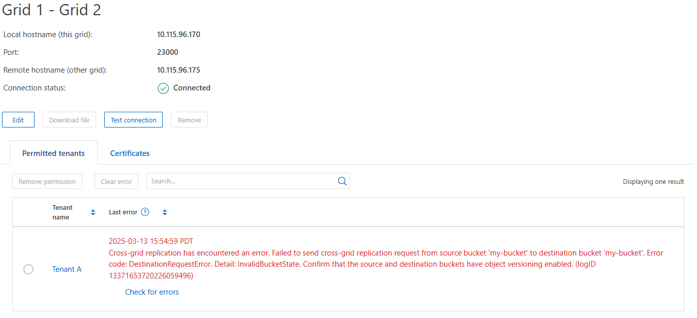

= 对网格联合错误进行故障排除
:allow-uri-read: 
:icons: font
:imagesdir: ../media/

[role="lead"]
您可能需要对与网格联合连接、帐户克隆和跨网格复制相关的警报和错误进行故障排除。

== [[grid联合错误]]网格联合连接警报和错误

您可能会收到有关网格联盟连接的警报或遇到错误。

在进行任何更改以解析连接问题描述 后，请测试该连接以确保连接状态返回到*conn岗位*。有关说明，请参阅link:grid-federation-manage-connection.html["管理网格联合连接"]。

=== Grid Federation connection failure警报

.问题描述
已触发*网格联合连接失败*警报。

.详细信息
此警报表示网格之间的网格联合连接不起作用。

.建议的操作
. 查看两个网格的网格联合页面上的设置。确认所有值均正确无误。请参阅。 link:grid-federation-manage-connection.html["管理网格联合连接"]
. 查看用于连接的证书。确保没有针对已过期的网格联合证书的警报、并且每个证书的详细信息有效。请参见中有关旋转连接证书的说明link:grid-federation-manage-connection.html["管理网格联合连接"]。
. 确认两个网格中的所有管理节点和网关节点均已联机且可用。解决可能影响这些节点的所有警报、然后重试。
. 如果您为本地或远程网格提供了完全限定域名(FQDN)、请确认DNS服务器联机且可用。有关网络连接、IP地址和DNS要求、请参见link:grid-federation-overview.html["什么是网格联合？"]。

=== 网格联合证书到期警报

.问题描述
已触发*网格联合证书到期*警报。

.详细信息
此警报指示一个或多个网格联合证书即将过期。

.建议的操作
请参见中有关旋转连接证书的说明link:grid-federation-manage-connection.html["管理网格联合连接"]。

=== 编辑网格联合连接时出错

.问题描述
编辑网格联合连接时，如果选择*保存并测试*，则会看到以下警告消息："Ffailed to create a candidate configuration file on one or more Nides"(无法在一个或多个节点上创建候选配置文件)。

.详细信息
编辑网格联合连接时、StorageGRID 会尝试在第一个网格的所有管理节点上保存"候选配置"文件。如果无法将此文件保存到所有管理节点(例如、由于某个管理节点脱机)、则会显示一条警告消息。

.建议的操作
. 从用于编辑连接的网格中，选择*节点*。
. 确认该网格的所有管理节点均已联机。
. 如果任何节点处于脱机状态、请将其恢复联机、然后重新尝试编辑连接。

== 帐户克隆错误

=== 无法登录到克隆的租户帐户

.问题描述
您无法登录到克隆的租户帐户。租户管理器登录页面上的错误消息为"您的此帐户凭据无效。请重试。"

.详细信息
出于安全原因、在将租户帐户从租户的源网格克隆到租户的目标网格时、您为租户的本地root用户设置的密码不会克隆。同样、当租户在其源网格上创建本地用户时、本地用户密码不会克隆到目标网格。

.建议的操作
在root用户登录到租户的目标网格之前、网格管理员必须首先登录到link:changing-password-for-tenant-local-root-user.html["更改本地root用户的密码"]目标网格。

在克隆的本地用户可以登录到租户的目标网格之前，克隆租户的根用户必须在目标网格上为该用户添加密码。有关说明，请参阅link:../tenant/manage-users.html["管理用户"]在使用租户管理器的说明中。

=== 租户在不使用克隆的情况下创建

.问题描述
在使用*使用网格联合连接*权限创建新租户后、您会看到消息"租户已创建但无克隆"。

.详细信息
如果连接状态更新延迟，发生原因 则可能会出现此问题描述 ，这可能会使运行状况不正常的连接显示为*conn象*。

.建议的操作
. 查看错误消息中列出的原因、并解决可能导致连接无法正常工作的任何网络或其他问题。请参阅。 <<grid-federation-errors,网格联合连接警报和错误>>
. 按照说明在中测试网格联合连接link:grid-federation-manage-connection.html["管理网格联合连接"]、以确认此问题已修复。
. 从租户的源网格中，选择*租户*。
. 找到无法克隆的租户帐户。
. 选择租户名称以显示详细信息页面。
. 选择*重试帐户克隆*。
+
image::../media/grid-federation-retry-account-clone.png[显示错误消息和重试帐户克隆按钮的屏幕截图]

+
如果错误已解决、则租户帐户现在将克隆到另一个网格。

== 跨网格复制警报和错误

=== 为连接或租户显示的最后一个错误

.问题描述
当link:../monitor/grid-federation-monitor-connections.html["查看网格联合连接"](或连接时link:grid-federation-manage-tenants.html["管理允许的租户"])您在连接详细信息页面的*上次错误*列中发现错误。例如：

.详细信息
对于每个网格联合连接，*最后一个错误*列显示租户数据复制到另一个网格时发生的最近错误（如果有）。此列仅显示最后发生的跨网格复制错误；不会显示可能发生的先前错误。此列中的错误可能由于以下原因之一而发生：

* 未找到源对象版本。
* 未找到源存储桶。
* 已删除此目标存储分段。
* 目标存储分段已由其他帐户重新创建。
* 目标存储分段已暂停版本控制。
* 目标存储分段已由同一帐户重新创建、但现在已取消版本控制。
* 源对象的 S3 对象锁定设置不符合目标网格的租户级保留设置。
* 源对象具有 S3 对象锁定设置，并且目标存储桶上的 S3 对象锁定已禁用。

.建议的操作
如果“*上次错误*”列中出现错误消息，请按照以下步骤操作：

. 查看消息文本。
. 执行任何建议的操作。例如、如果在目标存储分段上暂停版本控制以进行跨网格复制、请为此存储分段重新启用版本控制。
. 从表中选择连接或租户帐户。
. 选择*清除错误*。
. 选择*是*以清除消息并更新系统状态。
. 等待5-6分钟、然后将新对象插入存储分段。确认错误信息不会再次出现。
+

NOTE: 要确保清除错误消息、请在消息中的时间戳后至少等待5分钟、然后再输入新对象。

+

TIP: 清除错误后，如果在另一个存储分段中载入对象，并且该存储分段也存在错误，则可能会出现一个新的*last error*。

. 要确定是否有任何对象因存储分段错误而无法复制，请参见link:../admin/grid-federation-retry-failed-replication.html["确定并重试失败的复制操作"]。

=== 跨网格复制永久故障警报

.问题描述
已触发*跨网格复制永久失败*警报。

.详细信息
此警报指示无法在两个网格上的分段之间复制租户对象、原因是需要用户干预才能解决。此警报通常是由源存储分段或目标存储分段的更改引起的。

.建议的操作
. 登录到触发警报的网格。
. 转到*配置* > *系统* > *网格联合*，然后找到警报中列出的连接名称。
. 在允许的租户选项卡上、查看*上次错误*列以确定哪些租户帐户存在错误。
. 要了解有关此故障的详细信息、请参见中的说明link:../monitor/grid-federation-monitor-connections.html["监控网格联合连接"]以查看跨网格复制指标。
. 对于每个受影响的租户帐户：
+
.. 请参见中的说明link:../monitor/monitoring-tenant-activity.html["监控租户活动"]、确认租户未超过其在目标网格上用于跨网格复制的配额。
.. 根据需要、增加目标网格上的租户配额、以允许保存新对象。

. 对于每个受影响的租户、在两个网格上登录到租户管理器、以便比较存储分段列表。
. 对于已启用跨网格复制的每个存储分段、请确认以下内容：
+
** 同一租户在另一个网格上有对应的存储分段(必须使用确切名称)。
** 这两个分段均已启用对象版本控制(不能在任一网格上暂停版本控制)。
** 两个存储分段均未处于*删除对象：只读*状态。

. 要确认问题已解决、请参见中的说明link:../monitor/grid-federation-monitor-connections.html["监控网格联合连接"]以查看跨网格复制指标、或者执行以下步骤：
+
.. 返回到"网格联盟"页面。
.. 选择受影响的租户、然后在*上次错误*列中选择*清除错误*。
.. 选择*是*以清除消息并更新系统状态。
.. 等待5-6分钟、然后将新对象插入存储分段。确认错误信息不会再次出现。
+

NOTE: 要确保清除错误消息、请在消息中的时间戳后至少等待5分钟、然后再输入新对象。

+

NOTE: 解决警报后、可能需要长达一天时间才能清除警报。

.. 转到link:grid-federation-retry-failed-replication.html["确定并重试失败的复制操作"]以确定未能复制到其他网格的任何对象或删除标记、并根据需要重试复制。

=== 跨网格复制资源不可用警报

.问题描述
已触发*跨网格复制资源不可用*警报。

.详细信息
此警报表示跨网格复制请求处于待处理状态、因为资源不可用。例如、可能存在网络错误。

.建议的操作
. 监控警报以查看问题描述 是否自行解决。
. 如果问题描述 仍然存在，请确定其中一个网格对于同一连接是否具有*Grid Federation connection failure*警报，或者对于某个节点是否具有*Unable to与节点*通信警报。当您解决这些警报时、可能会解决此警报。
. 要了解有关此故障的详细信息、请参见中的说明link:../monitor/grid-federation-monitor-connections.html["监控网格联合连接"]以查看跨网格复制指标。
. 如果无法解决此警报、请联系技术支持。

解决问题描述 后、跨网格复制将正常进行。
