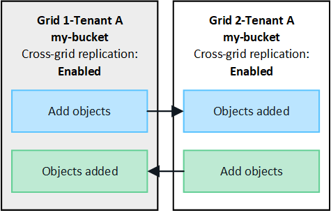

= 什么是跨网格复制？
:allow-uri-read: 
:icons: font
:imagesdir: ../media/

[role="lead"]
跨网格复制是指在中连接的两个StorageGRID系统中的选定S3分段之间自动复制对象link:grid-federation-overview.html["网格联合连接"]。link:grid-federation-what-is-account-clone.html["帐户克隆"]跨网格复制需要。

== 跨网格复制工作流

工作流程图总结了在两个网格上的存储桶之间配置跨网格复制的步骤。

image::../media/grid-federation-cgr-workflow.png[跨网格复制工作流]

== 跨网格复制的要求

如果租户帐户具有使用网格联合连接权限，可以使用一个或多个link:grid-federation-overview.html["网格联合连接"]，具有Root访问权限的租户用户可以在每个网格上对应的租户账户中创建bucket。这些存储桶：

* 可以有不同的名称
* 可以有不同的区域
* 必须启用版本控制
* 必须为空

创建这两个分段后、可以为其中一个分段或这两个分段配置跨网格复制。

.了解更多信息。
link:../tenant/grid-federation-manage-cross-grid-replication.html["管理跨网格复制"]

== 跨网格复制的工作原理

您可以将跨网格复制配置为单向或双向进行。

=== 单向复制

如果仅为一个网格上的存储桶启用跨网格复制，则添加到该存储桶（源存储桶）的对象将被复制到另一个网格上的相应存储桶（目标存储桶）。但是，添加到目标存储桶的对象不会被复制回源。图中，启用了跨网格复制 `my-bucket`从网格 1 到网格 2，但在另一个方向则无法启用。

image::../media/grid-federation-cross-grid-replication-one-direction.png[显示一个方向的网格联合连接的图像]

=== 双向复制

如果为两个网格上的同一存储分段启用跨网格复制、则添加到任一存储分段的对象将复制到另一个网格。在图中、跨网格复制在两个方向上均已启用 `my-bucket`。

=== 当对象被加热时会发生什么情况？

当S3客户端向启用了跨网格复制的存储分段添加对象时、会发生以下情况：

. StorageGRID 会自动将对象从源存储分段复制到目标存储分段。执行此后台复制操作所需的时间取决于多个因素、包括待处理的其他复制操作的数量。
+
S3 客户端可以通过发出 GetObject 或 HeadObject 请求来验证对象的复制状态。响应包括StorageGRID特定的 `x-ntap-sg-cgr-replication-status`响应头，其值为以下之一：

+
[cols="1a,2a"]
|===
| 网格 | 复制状态 

 a| 
源
 a| 
** *completed*：所有网格连接的复制均成功。
** *pending *：对象尚未复制到至少一个网格连接。
** *失败*：复制未等待任何电网连接，并且至少有一个电网连接发生永久性故障。用户必须解决该错误。

 a| 
目标
 a| 
*REPRAM*：对象已从源网格复制。

|===
+

NOTE: StorageGRID不支持 `x-amz-replication-status`标头。

. StorageGRID使用每个网格的活动ILM策略来管理对象、就像管理任何其他对象一样。例如、网格1上的对象A可能会存储为两个复制副本并永久保留、而复制到网格2的对象A的副本可能会使用2+1纠删编码进行存储、并在三年后删除。

=== 删除对象时会发生什么情况？

如中所述link:../primer/delete-data-flow.html["删除数据流"]，StorageGRID可以出于以下任一原因删除对象：

* S3客户端发出删除请求。
* 租户管理器用户link:../tenant/deleting-s3-bucket-objects.html["删除存储分段中的对象"]可选择从存储分段中删除所有对象。
* 此存储分段具有生命周期配置、此配置将过期。
* 对象的ILM规则中的最后一个时间段结束、并且未指定其他放置位置。

如果StorageGRID 因"删除存储分段"操作中的对象、存储分段生命周期到期或ILM放置到期而删除对象、则不会从网格联合连接中的其他网格中删除复制的对象。但是、S3客户端删除操作添加到源存储分段的删除标记可以选择复制到目标存储分段。

要了解S3客户端从启用了跨网格复制的存储分段中删除对象时会发生什么情况、请查看S3客户端如何从启用了版本控制的存储分段中删除对象、如下所示：

* 如果S3客户端发出包含版本ID的删除请求、则该对象的版本将被永久删除。不会向存储分段添加任何删除标记。
* 如果 S3 客户端发出不包含版本 ID 的删除请求， StorageGRID不会删除任何对象版本。相反，它会向存储桶添加一个删除标记。删除标记使StorageGRID表现得好像对象已被删除：
+
** 没有版本 ID 的 GetObject 请求失败，并显示 `404 No Object Found`
** 具有有效版本 ID 的 GetObject 请求成功并返回请求的对象版本。

当S3客户端从启用了跨网格复制的存储分段中删除对象时、StorageGRID 将确定是否将删除请求复制到目标、如下所示：

* 如果删除请求包含版本 ID，则该对象版本将从源网格中永久删除。但是， StorageGRID不会复制包含版本 ID 的删除请求，因此相同的对象版本不会从目标中删除。
* 如果删除请求不包含版本 ID， StorageGRID可以根据存储桶的跨网格复制配置方式选择性地复制删除标记：
+
** 如果选择复制删除标记(默认)、则会将删除标记添加到源存储分段并复制到目标存储分段。实际上，该对象在两个网格上似乎都被删除。
** 如果您选择不复制删除标记，则删除标记将添加到源存储桶，但不会复制到目标存储桶。实际上，在源网格上删除的对象不会在目标网格上删除。

在图中，当link:../tenant/grid-federation-manage-cross-grid-replication.html["已启用跨网格复制"]。包含版本 ID 的源存储桶的删除请求不会从目标存储桶中删除对象。不包含版本 ID 的源存储桶的删除请求似乎会删除目标存储桶中的对象。

image::../media/grid-federation-cross-grid-replication-delete.png[显示在两个网格上复制客户端删除的图像]

NOTE: 如果要使对象删除在网格之间保持同步、请为两个网格上的分段创建相应的link:../s3/create-s3-lifecycle-configuration.html["S3生命周期配置"]。

=== 如何复制加密对象

使用跨网格复制在网格之间复制对象时、您可以对单个对象进行加密、使用默认分段加密或配置网格范围的加密。在为存储分段启用跨网格复制之前或之后、您可以添加、修改或删除默认存储分段或网格范围的加密设置。

要对单个对象进行加密、可以在向源存储分段添加对象时使用SSE (使用StorageGRID托管密钥的服务器端加密)。使用 `x-amz-server-side-encryption`请求标头并指定 `AES256`。请参阅。 link:../s3/using-server-side-encryption.html["使用服务器端加密"]

NOTE: 跨网格复制不支持使用 SSE-C（使用客户提供的密钥的服务器端加密）。摄取操作将会失败。

要对存储分段使用默认加密，请使用PutBucketEncryption请求并将参数设置 `SSEAlgorithm`为 `AES256`。存储分段级加密适用于未包含请求标头的任何已加载对象 `x-amz-server-side-encryption`。请参阅。 link:../s3/operations-on-buckets.html["对存储分段执行的操作"]

要使用网格级加密，请将*存储对象加密*选项设置为*AES-256*。网格级加密适用于未在存储分段级别进行加密的任何对象、或者不带请求标头的已加载对象 `x-amz-server-side-encryption`。请参阅。 link:../admin/changing-network-options-object-encryption.html["配置网络和对象选项"]

NOTE: SSE 不支持 AES-128。如果使用 *AES-128* 选项为源网格启用了 *存储对象加密* 选项，则 AES-128 算法的使用不会传播到复制的对象。相反，复制的对象使用目标的默认存储桶或网格级加密设置（如果可用）。

在确定如何对源对象进行加密时、StorageGRID 会应用以下规则：

. 如果存在、请使用" `x-amz-server-side-encryption`加载"标题。
. 如果不存在摄取标头，则使用存储桶默认加密设置（如果已配置）。
. 如果未配置存储桶设置，则使用网格范围的加密设置（如果已配置）。
. 如果不存在网格范围的设置，则不要加密源对象。

在确定如何对复制的对象进行加密时、StorageGRID 会按以下顺序应用这些规则：

. 使用与源对象相同的加密、除非该对象使用AES-128加密。
. 如果源对象未加密或使用 AES-128，则使用目标存储桶的默认加密设置（如果已配置）。
. 如果目标存储桶没有加密设置，则使用目标的网格范围加密设置（如果已配置）。
. 如果不存在网格范围的设置，则不要加密目标对象。

=== 使用 S3 对象锁进行跨网格复制

您可以在以下情况下配置启用了 S3 对象锁定的StorageGRID桶之间的跨网格复制。

[cols="1a,1a"]
|===
| 当源存储桶上的 S3 对象锁定是... | 目标存储桶上的 S3 对象锁是... 

 a| 
已启用
 a| 
已启用

 a| 
已禁用
 a| 
已启用

|===
当源存储桶上的 S3 对象锁定启用时：

* 对象按照以下顺序在目标处使用保留设置进行锁定：
+
.. 源对象的保留标头值为：
+
`x-amz-object-lock-mode`

+
`x-amz-object-lock-retain-until-date`

.. 源存储桶的默认保留（如果设置）。
.. 目标存储桶的默认保留（如果设置）。

+
目标存储桶的默认保留不会覆盖从源对象复制的保留设置。

* 您可以使用以下方式设置目标对象的合法保留状态 `x-amz-object-lock-legal-hold`上传对象时。
* 如果目标租户或存储桶不支持源对象的 S3 对象锁定设置，则会发生错误。请参阅link:../admin/grid-federation-troubleshoot.html#cross-grid-replication-alerts-and-errors["跨网格复制警报和错误。"]

当源存储桶上的 S3 对象锁定被禁用时：

* 您可以在目标存储桶上配置默认保留，以将 S3 对象锁定保留设置应用于目标对象。
* 目标对象无法设置合法保留状态。

=== 不支持PutObjectTaging.和DeleteObjectTaging

启用了跨网格复制的分段中的对象不支持PutObjectTbaging和DeleteObjectTbagingrequests。

如果 S3 客户端发出 PutObjectTagging 或 DeleteObjectTagging 请求， `501 Not Implemented`被退回。消息是 `Put(Delete) ObjectTagging isn't available for buckets that have cross-grid replication configured`。

=== 不支持 PutObjectRetention 和 PutObjectLegalHold

对于启用了跨网格复制的存储桶中的对象，PutObjectRetention 和 PutObjectLegalHold 请求不完全支持。

如果 S3 客户端发出 PutObjectRetention 或 PutObjectLegalHold 请求，则会修改源对象的设置，但更改不会应用到目标。

=== 分段对象的复制方式

源网格的最大段大小适用于复制到目标网格的对象。当对象被复制到另一个网格时，两个网格都会使用源网格的*最大段大小*设置（*配置* > *系统* > *存储选项*）。例如，假设源网格的最大段大小为 1 GB，而目标网格的最大段大小为 50 MB。如果您在源网格上提取一个 2 GB 的对象，则该对象将保存为两个 1 GB 的段。它还会作为两个 1 GB 的段复制到目标网格，尽管该网格的最大段大小为 50 MB。
