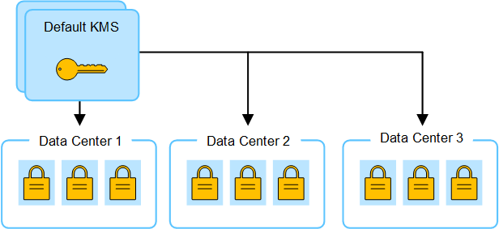

= 更改站点的 KMS 的注意事项
:allow-uri-read: 
:icons: font
:imagesdir: ../media/

[role="lead"]
每个密钥管理服务器（ Key Management Server ， KMS ）或 KMS 集群都会为单个站点或一组站点上的所有设备节点提供一个加密密钥。如果需要更改站点使用的 KMS ，则可能需要将加密密钥从一个 KMS 复制到另一个 KMS 。

如果更改站点使用的 KMS ，则必须确保可以使用存储在新 KMS 上的密钥对该站点上先前加密的设备节点进行解密。在某些情况下，您可能需要将当前版本的加密密钥从原始 KMS 复制到新 KMS 。您必须确保 KMS 具有正确的密钥，以便对站点上的加密设备节点进行解密。

例如：

. 您最初会配置一个默认KMS、用于适用场景 所有没有专用KMS的站点。
. 保存 KMS 后，所有启用了 * 节点加密 * 设置的设备节点都会连接到 KMS 并请求加密密钥。此密钥用于对所有站点上的设备节点进行加密。此外，还必须使用此相同密钥对这些设备进行解密。
+

. 您决定为一个站点（图中的数据中心 3 ）添加站点专用的 KMS 。但是，由于设备节点已加密，因此在尝试保存站点专用 KMS 的配置时会发生验证错误。之所以出现此错误，是因为站点特定的 KMS 没有正确的密钥来对该站点上的节点进行解密。
+
image::../media/kms_wrong_key.png[Kms 错误密钥]

. 要解决问题描述 问题，请将当前版本的加密密钥从默认 KMS 复制到新的 KMS 。（从技术上讲，您可以将原始密钥复制到具有相同别名的新密钥。原始密钥将成为新密钥的先前版本。)现在、站点专用的KMS具有正确的密钥、可用于对数据中心3上的设备节点进行解密、因此可以将其保存在StorageGRID中。
+
image::../media/kms_copied_key.png[Kms 复制的密钥]

== 更改站点使用的 KMS 的用例

下表总结了更改站点 KMS 的最常见情况下所需的步骤。

[cols="1a,2a"]
|===
| 更改站点 KMS 的用例 | 所需步骤 

 a| 
您有一个或多个站点特定的 KMS 条目，并且希望使用其中一个条目作为默认 KMS 。
 a| 
编辑站点特定的 KMS 。在 * 管理密钥 * 字段中，选择 * 不受其他 KMS （默认 KMS ）管理的站点 * 。现在，站点专用的 KMS 将用作默认 KMS 。它将适用于没有专用KMS的任何站点。

link:kms-editing.html["编辑密钥管理服务器（ KMS ）"]

 a| 
您有一个默认 KMS ，并且在扩展中添加了一个新站点。您不想对新站点使用默认KMS。
 a| 
. 如果新站点上的设备节点已被默认 KMS 加密，请使用 KMS 软件将当前版本的加密密钥从默认 KMS 复制到新 KMS 。
. 使用网格管理器添加新的 KMS 并选择站点。

link:kms-adding.html["添加密钥管理服务器（ KMS ）"]

 a| 
您希望站点的 KMS 使用其他服务器。
 a| 
. 如果站点上的设备节点已由现有 KMS 加密，请使用 KMS 软件将当前版本的加密密钥从现有 KMS 复制到新 KMS 。
. 使用网格管理器编辑现有 KMS 配置并输入新的主机名或 IP 地址。

link:kms-adding.html["添加密钥管理服务器（ KMS ）"]

|===