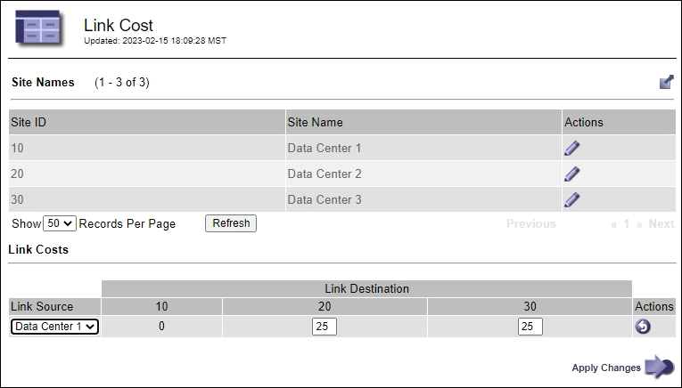

= 管理链路成本
:allow-uri-read: 
:icons: font
:imagesdir: ../media/

[role="lead"]
链路成本可用于确定存在两个或更多数据中心站点时哪个数据中心站点提供请求的服务的优先级。您可以调整链路成本以反映站点之间的延迟。

== 什么是链路成本？

* 链接成本用于确定用于实现对象检索的对象副本的优先级。
* 网格管理 API 和租户管理 API 使用链路成本来确定要使用的内部 StorageGRID 服务。
* 管理节点和网关节点上的负载平衡器服务使用链路开销来指导客户端连接。请参阅。 link:../admin/managing-load-balancing.html["负载平衡注意事项"]

此图显示了一个三站点网格，其中在站点之间配置了链路成本：

image::../media/link_costs.gif[数据中心之间链路成本的概念图]

* 管理节点和网关节点上的负载平衡器服务会将客户端连接平均分布到同一数据中心站点上的所有存储节点以及链路成本为0的任何数据中心站点。
+
在此示例中，数据中心站点 1 （ DC1 ）的网关节点会将客户端连接平均分布到 DC1 的存储节点和 DC2 的存储节点。DC3 上的网关节点仅向 DC3 上的存储节点发送客户端连接。

* 在检索作为多个复制副本存在的对象时， StorageGRID 会在链路成本最低的数据中心检索此副本。
+
在此示例中、如果DC2的客户端应用程序检索到同时存储在DC1和DC3的对象、则会从DC1检索该对象、因为从DC1到DC2的链路成本为0、低于从DC3到DC2的链路成本(25)。

链路成本是任意的相对数字，没有特定的度量单位。例如，使用链路成本 50 比使用链路成本 25 更低。下表显示了常用链路成本。

[cols="1a,1a,2a"]
|===
| 链路 | 链路成本 | 备注 

 a| 
物理数据中心站点之间
 a| 
25 (默认)
 a| 
通过 WAN 链路连接的数据中心。

 a| 
位于同一物理位置的逻辑数据中心站点之间
 a| 
0
 a| 
逻辑数据中心位于通过 LAN 连接的同一物理建筑或园区中。

|===

== 更新链路成本

您可以更新数据中心站点之间的链路成本，以反映站点之间的延迟。

.开始之前
* 您已使用登录到网格管理器link:../admin/web-browser-requirements.html["支持的 Web 浏览器"]。
* 你有link:admin-group-permissions.html["其他网格配置权限"]。

.步骤
. 选择*支持* > *其他* > *链接成本*。
+

. 在 * 链路源 * 下选择一个站点，然后在 * 链路目标 * 下输入一个介于 0 和 100 之间的成本值。
+
如果源与目标相同、则无法更改链接成本。

+
要取消更改，请选择image:../media/nms_revert.gif["撤消图标"]*恢复*。

. 选择 * 应用更改 * 。

