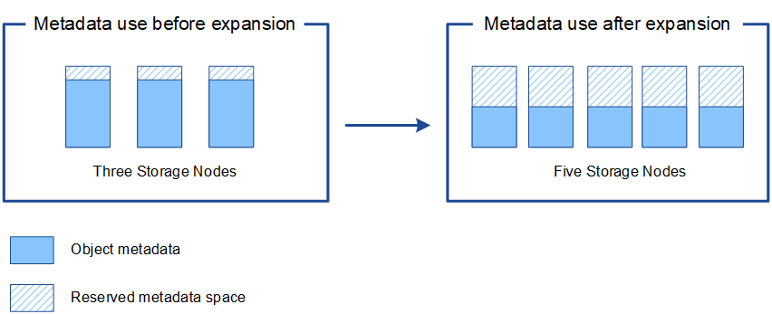

= 添加元数据容量
:allow-uri-read: 
:icons: font
:imagesdir: ../media/

[role="lead"]
要确保为对象元数据提供足够的可用空间，您可能需要执行扩展操作步骤 以在每个站点添加新的存储节点。

StorageGRID 会为每个存储节点的卷 0 上的对象元数据预留空间。每个站点维护三个所有对象元数据副本，这些副本均匀分布在所有存储节点上。

您可以使用网格管理器监控存储节点的元数据容量，并估计元数据容量的使用速度。此外，当已用元数据空间达到特定阈值时，系统会为存储节点触发 * 低元数据存储 * 警报。

请注意，根据网格的使用方式，网格的对象元数据容量消耗速度可能比其对象存储容量更快。例如，如果您通常要载入大量小对象或向对象添加大量用户元数据或标记，则即使仍有足够的对象存储容量，您可能需要添加存储节点以增加元数据容量。

有关详细信息，请参见以下内容：

* link:../admin/managing-object-metadata-storage.html["管理对象元数据存储"]
* link:../monitor/monitoring-storage-capacity.html#monitor-object-metadata-capacity-for-each-storage-node["监控每个存储节点的对象元数据容量"]

== 增加元数据容量的准则

在添加存储节点以增加元数据容量之前，请查看以下准则和限制：

* 假设有足够的对象存储容量可用，则为对象元数据提供更多的可用空间将增加可存储在 StorageGRID 系统中的对象数量。
* 您可以通过向每个站点添加一个或多个存储节点来增加网格的元数据容量。
* 在任何给定存储节点上为对象元数据预留的实际空间取决于元数据预留空间存储选项（系统范围设置），分配给节点的 RAM 量以及节点卷 0 的大小。
* 您不能通过向现有存储节点添加存储卷来增加元数据容量、因为元数据仅存储在卷0上。
* 您不能通过添加新站点来增加元数据容量。
* StorageGRID 会为每个站点上的所有对象元数据保留三个副本。因此，系统的元数据容量受最小站点的元数据容量限制。
* 在添加元数据容量时，应向每个站点添加相同数量的存储节点。

纯元数据存储节点具有特定的硬件要求：

* 使用StorageGRID设备时、只能在具有12个1.9 TB或12个3.8 TB驱动器的GF6112设备上配置纯元数据节点。
* 使用基于软件的节点时、纯元数据节点资源必须与现有存储节点资源匹配。例如：
+
** 如果现有StorageGRID站点使用SG6000或SG6100设备、则基于软件的纯元数据节点必须满足以下最低要求：
+
*** 128 GB RAM
*** 8核CPU
*** 用于cassandr数据库的8 TB SSD或等效存储(rangedb/0)

** 如果现有StorageGRID站点正在使用具有24 GB RAM、8核CPU以及3 TB或4 TB元数据存储的虚拟存储节点、则基于软件的纯元数据节点应使用类似的资源(24 GB RAM、8核CPU和4 TB元数据存储(rangedb/0)。

* 添加新StorageGRID站点时、新站点的元数据总容量至少应与现有StorageGRID站点匹配、新站点资源应与现有StorageGRID站点的存储节点匹配。

请参见link:../admin/managing-object-metadata-storage.html["什么是元数据预留空间的问题描述"]。

== 添加存储节点时如何重新分配元数据

在扩展中添加存储节点时， StorageGRID 会将现有对象元数据重新分发到每个站点的新节点，从而增加网格的整体元数据容量。无需用户操作。

下图显示了在扩展中添加存储节点时 StorageGRID 如何重新分发对象元数据。图的左侧表示扩展之前三个存储节点的卷 0 。元数据占用了每个节点可用元数据空间的相对较大部分，并且已触发 "* 低元数据存储 * " 警报。

图的右侧显示了在向站点添加两个存储节点后如何重新分配现有元数据。每个节点上的元数据数量已减少，不再触发 * 元数据存储不足 * 警报，并且可用于元数据的空间已增加。

