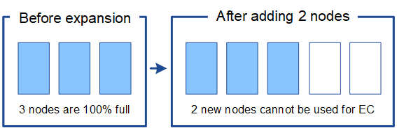

= 重新平衡经过纠删编码的数据的注意事项
:allow-uri-read: 
:icons: font
:imagesdir: ../media/

[role="lead"]
如果要执行扩展以添加存储节点、并且要使用ILM规则来纠删代码数据、则如果无法为所使用的纠删编码方案添加足够的存储节点、则可能需要执行纠删编码(EC)重新平衡过程。

查看这些注意事项后、请执行扩展、然后转到link:rebalancing-erasure-coded-data-after-adding-storage-nodes.html["添加存储节点后重新平衡经过纠删编码的数据"]运行此过程。

== 什么是 EC 重新平衡？

EC 重新平衡是扩展存储节点后可能需要的 StorageGRID 操作步骤 。操作步骤 将作为主管理节点上的命令行脚本运行。运行EC重新平衡操作步骤 时、StorageGRID 会在站点的现有存储节点和新添加的存储节点之间重新分布纠删编码的片段。

EC 重新平衡操作步骤 ：

* 仅移动经过纠删编码的对象数据。它不会移动复制的对象数据。
* 在站点内重新分布数据。它不会在站点之间移动数据。
* 在站点的所有存储节点之间重新分布数据。它不会在存储卷中重新分配数据。
* 在确定要将经过筛选的数据移动到何处时、不会考虑每个存储节点上复制的数据使用量。
* 在存储节点之间均匀地重新分布经过审核的数据、而不考虑每个节点的相对容量。
* 不会向已满80%以上的存储节点分发经过数据经过了数据经过了除名的数据。
* 可能会在运行ILM操作和S3客户端操作时降低性能&#8212；重新分布纠删编码片段需要额外的资源。

完成 EC 重新平衡操作步骤 后：

* 经过删除编码的数据将从可用空间较少的存储节点移至可用空间较多的存储节点。
* 擦除编码对象的数据保护将保持不变。
* 不同存储节点的已用(%)值可能不同、原因有两个：
+
** 复制的对象副本将继续占用现有节点上的空间##8212;EC重新平衡操作步骤 不会移动复制的数据。
** 与容量较小的节点相比、容量较大的节点的填充度相对较低、即使所有节点最终都会产生大约相同数量的经过重复数据的数据。
+
例如、假设三个200 TB节点的容量均达到80%(200 &#215；0.8 =每个节点160 TB、或站点480 TB)。如果添加一个400 TB节点并运行重新平衡操作步骤 、则所有节点现在都将具有大致相同的erasure代码数据量(480/4 = 120 TB)。但是、较大节点的已用(%)将小于较小节点的已用(%)。

+
image::../media/used_space_with_larger_node.png[扩展前已用空间]

== 何时重新平衡已通过数据进行了数据迁移

请考虑以下情形：

* StorageGRID 正在一个站点上运行，该站点包含三个存储节点。
* ILM策略对大于1.0 MB的所有对象使用2+1擦除编码规则、对较小的对象使用双副本复制规则。
* 所有存储节点均已全满。已在主要严重性级别触发“*对象存储不足*”警报。
+
image::../media/used_space_before_expansion.png[扩展前已用空间]

=== 如果添加了足够多的节点、则不需要重新平衡

要了解何时不需要EC重新平衡、假设您添加了三个(或更多)新存储节点。在这种情况下、您不需要执行EC重新平衡。原始存储节点将保持已满、但新对象现在将使用这三个新节点进行2+1纠删编码##8212；两个数据片段和一个奇偶校验片段可以分别存储在不同的节点上。

image::../media/used_space_after_3_node_expansion.png[3节点扩展后的已用空间]

CAUTION: 在这种情况下、虽然您可以运行EC重新平衡操作步骤 、但移动现有纠删编码的数据会暂时降低网格的性能、从而可能影响客户端操作。

=== 如果无法添加足够多的节点、则需要重新平衡

要了解何时需要EC重新平衡、假设您只能添加两个存储节点、而不能添加三个存储节点。由于2+1方案至少需要三个存储节点具有可用空间、因此、这些空节点不能用于新的已通过erasure编码的数据。

要使用新的存储节点、应运行EC重新平衡操作步骤。运行此操作步骤 时、StorageGRID 会在站点的所有存储节点之间重新分布现有的经过删除的数据和奇偶校验片段。在此示例中、当EC重新平衡操作步骤完成后、所有五个节点的容量现在仅为60%、并且可以继续将对象插入到所有存储节点上的2+1纠删编码方案中。

image::../media/used_space_after_ec_rebalance.png[在 EC 重新平衡后已用空间]

== EC重新平衡的建议

如果以下陈述中的_all_为真、则NetApp需要EC重新平衡：

* 您可以对对象数据使用纠删编码。
* 已针对站点上的一个或多个存储节点触发 * 对象存储空间不足 * 警报，表示这些节点已满 80% 或以上。
* 您无法为正在使用的纠删编码方案添加足够多的新存储节点。请参阅。 link:adding-storage-capacity-for-erasure-coded-objects.html["为经过纠删编码的对象添加存储容量"]
* 在运行EC重新平衡过程时、S3客户端的写入和读取操作性能可能会降低。

如果您希望将存储节点填充到类似级别、并且在运行EC重新平衡过程期间、S3客户端的写入和读取操作性能可以降低、则可以选择运行EC重新平衡过程。

== EC 重新平衡操作步骤 如何与其他维护任务进行交互

您不能在运行EC重新平衡操作步骤 的同时执行某些维护过程。

[cols="1a,2a"]
|===
| 操作步骤 | 在 EC 重新平衡操作步骤 期间是否允许？ 

 a| 
其他 EC 重新平衡过程
 a| 
否

一次只能运行一个 EC 重新平衡操作步骤 。

 a| 
停用操作步骤

EC 数据修复作业
 a| 
否

* 在 EC 重新平衡操作步骤 运行期间，系统会阻止您启动停用操作步骤 或 EC 数据修复。
* 在存储节点停用操作步骤 操作步骤 或 EC 数据修复正在运行时，系统会阻止您启动 EC 重新平衡。

 a| 
扩展操作步骤
 a| 
否

如果您需要在扩展中添加新存储节点、请在添加所有新节点后运行EC重新平衡操作步骤。

 a| 
升级操作步骤
 a| 
否

如果您需要升级StorageGRID 软件、请在运行EC重新平衡操作步骤 之前或之后执行升级操作步骤。您可以根据需要终止 EC 重新平衡操作步骤 以执行软件升级。

 a| 
设备节点克隆操作步骤
 a| 
否

如果您需要克隆设备存储节点、请在添加新节点后运行EC重新平衡操作步骤。

 a| 
修补程序操作步骤
 a| 
是。

您可以在 EC 重新平衡操作步骤 运行期间应用 StorageGRID 修补程序。

 a| 
其他维护过程
 a| 
否

在运行其他维护过程之前，您必须终止 EC 重新平衡操作步骤 。

|===

== EC 重新平衡操作步骤 如何与 ILM 交互

在运行 EC 重新平衡操作步骤 时，请避免进行可能会更改现有纠删编码对象位置的 ILM 更改。例如、不要开始使用具有不同纠删编码配置文件的ILM规则。如果需要进行此类ILM更改、则应终止EC重新平衡操作步骤。
