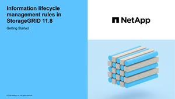

= 使用 ILM 管理对象
:allow-uri-read: 
:icons: font
:imagesdir: ../media/

[role="lead"]
ILM策略中的信息生命周期管理(ILM)规则指示StorageGRID如何创建和分发对象数据副本以及如何长期管理这些副本。

== 关于这些说明

设计和实施ILM规则和策略需要仔细规划。您必须了解操作要求， StorageGRID 系统的拓扑结构，对象保护需求以及可用存储类型。然后，您必须确定希望如何复制，分发和存储不同类型的对象。

按照以下说明执行以下操作：

* 了解StorageGRID ILM，包括link:how-ilm-operates-throughout-objects-life.html["ILM如何在对象的整个生命周期内运行"]。
* 了解如何配置link:what-storage-pool-is.html["存储池"]、link:what-cloud-storage-pool-is.html["云存储池"]和link:what-ilm-rule-is.html["ILM 规则"]。
* 了解如何link:creating-ilm-policy.html["创建、模拟和激活ILM策略"]保护一个或多个站点上的对象数据。
* 了解如何link:managing-objects-with-s3-object-lock.html["使用S3对象锁定管理对象"]，这有助于确保特定S3存储分段中的对象在指定的时间内不会被删除或覆盖。

== 了解更多信息。

要了解更多信息，请查看以下视频：

* https://netapp.hosted.panopto.com/Panopto/Pages/Viewer.aspx?id=9872d38f-80b3-4ad4-9f79-b1ff008760c7["视频：ILM规则概述"^](英文)
+
[link=https://netapp.hosted.panopto.com/Panopto/Pages/Viewer.aspx?id=9872d38f-80b3-4ad4-9f79-b1ff008760c7]

* https://netapp.hosted.panopto.com/Panopto/Pages/Viewer.aspx?id=e768d4da-da88-413c-bbaa-b1ff00874d10["视频：ILM策略概述"^]
+
[link=https://netapp.hosted.panopto.com/Panopto/Pages/Viewer.aspx?id=e768d4da-da88-413c-bbaa-b1ff00874d10]
image::../media/video-screenshot-ilm-policies-118.png[视频：ILM策略概述]

