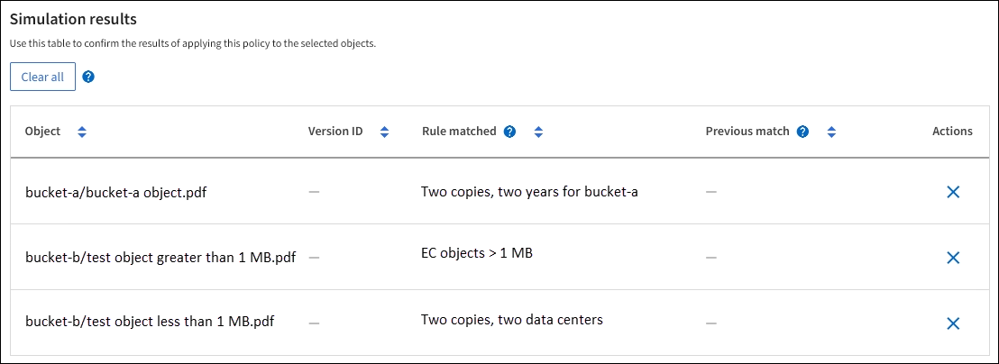

= ILM策略模拟示例
:allow-uri-read: 
:icons: font
:imagesdir: ../media/

[role="lead"]
ILM策略模拟示例提供了为您的环境构建和修改模拟的准则。

== 示例1：模拟ILM策略时验证规则

此示例介绍了如何在模拟策略时验证规则。

在此示例中，正在针对两个分段中的输入对象模拟 * 示例 ILM 策略 * 。此策略包括三个规则，如下所示：

* 第一条规则 * 两个副本，即 bucket-A* 两年，仅适用于 bucket-a 中的对象
* 第二条规则 * EC 对象 > 1 MB* ，适用场景 all b桶 but filters on objects 大于 1 MB 。
* 第三条规则为 * 两个副本，两个数据中心 * 。它不包含任何筛选器，也不使用非当前参考时间。

模拟策略后、确认每个对象均符合正确的规则。

在此示例中：

* `bucket-a/bucket-a object.pdf`正确匹配了第一个规则，该规则按中的对象进行筛选 `bucket-a`。
* `bucket-b/test object greater than 1 MB.pdf`是中的 `bucket-b`，因此与第一个规则不匹配。而是通过第二条规则正确匹配，该规则会对大于 1 MB 的对象进行筛选。
* `bucket-b/test object less than 1 MB.pdf`与前两个规则中的筛选器不匹配、因此它将由默认规则放置、该规则不包含任何筛选器。

== 示例2：模拟ILM策略时对规则重新排序

此示例显示了在模拟策略时如何重新排列规则以更改结果。

在此示例中，正在模拟 * 演示 * 策略。此策略用于查找具有 series=x-men 用户元数据的对象，它包含以下三个规则：

* 第一个规则*PNGs*过滤以结尾的键名 `.png`。
* 第二条规则*X-men*仅适用于租户A的对象并筛选 `series=x-men`用户元数据。
* 最后一条规则*two copes two data centres *是默认规则，它匹配与前两条规则不匹配的任何对象。

.步骤
. 添加规则并保存策略后，选择 * 模拟 * 。
. 在*Object*字段中，输入测试对象的S3存储分段/object-key，然后选择*sobject*。
+
此时将显示模拟结果，显示 `Havok.png`对象已与*PNGs*规则匹配。

+
image::../media/simulate_reorder_rules_pngs_result.png[示例2：模拟ILM策略时重新排列规则]

+
但是， `Havok.png`是为了测试*X-men*规则。

. 要解析问题描述 ，请对规则重新排序。
+
.. 选择*完成*以关闭模拟ILM策略窗口。
.. 选择 * 编辑 * 以编辑策略。
.. 将 *X-men* 规则拖动到列表顶部。
.. 选择 * 保存 * 。

. 选择 * 模拟 * 。
+
系统会根据更新后的策略重新评估先前测试的对象，并显示新的模拟结果。在此示例中、"规则匹配"列显示 `Havok.png`对象现在与X-MEN元数据规则符合预期。上一个匹配列显示了与上一个模拟中的对象匹配的PNG规则。

+
image::../media/simulate_reorder_rules_correct_result.png[示例2：模拟ILM策略时重新排列规则]

== 示例3：模拟ILM策略时更正规则

此示例显示了如何模拟策略，更正策略中的规则以及继续模拟。

在此示例中，正在模拟 * 演示 * 策略。此策略用于查找包含用户元数据的对象 `series=x-men`。但是、针对对象模拟此策略时会出现意外结果 `Beast.jpg`。该对象与默认规则匹配，而不是与 X-men 元数据规则匹配，而是复制两个数据中心。

image::../media/simulate_results_for_object_wrong_metadata.png[示例3：在模拟ILM策略时更正规则]

如果测试对象与策略中的预期规则不匹配，则必须检查策略中的每个规则并更正任何错误。

.步骤
. 选择*完成*以关闭模拟策略对话框。在策略的详细信息页面上，选择*保留图*。然后根据需要为每个规则选择*全部展开*或*查看详细信息*。
. 查看规则的租户帐户，参考时间和筛选条件。
+
例如、假设X-men规则的元数据输入为"x-men01"、而不是"x-men"。

. 要解决此错误、请按如下所示更正此规则：
+
** 如果规则属于策略的一部分、您可以克隆规则、也可以从策略中删除规则、然后对其进行编辑。
** 如果规则是活动策略的一部分，则必须克隆此规则。您不能编辑或删除活动策略中的规则。

. 再次执行模拟。
+
在此示例中、更正后的X-MEN规则现在会按预期根据用户元数据匹配 `Beast.jpg`对象 `series=x-men`。

+
image::../media/simulate_results_for_object_corrected_metadata.png[示例3：在模拟ILM策略时更正规则]

