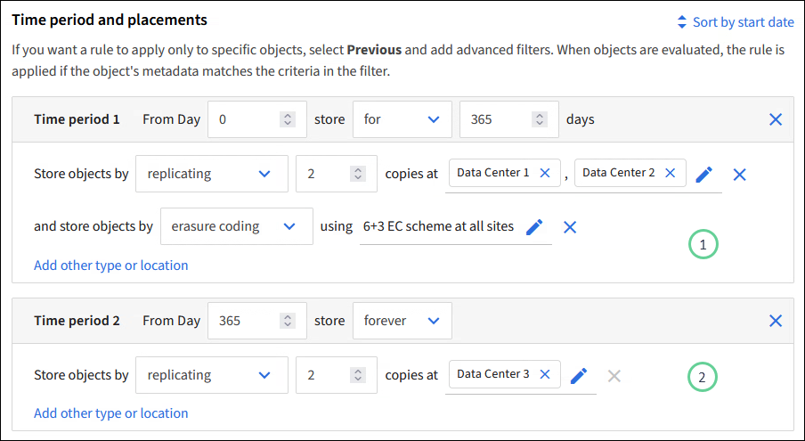

= 使用ILM规则管理对象
:allow-uri-read: 
:icons: font
:imagesdir: ../media/

[role="lead"]
要管理对象，您需要创建一组信息生命周期管理（ ILM ）规则，并将其组织到 ILM 策略中。

系统中载入的每个对象都会根据活动策略进行评估。如果策略中的规则与对象的元数据匹配，则规则中的说明将确定 StorageGRID 复制和存储该对象所采取的操作。

NOTE: 对象元数据不受ILM规则管理。而是将对象元数据存储在 Cassandra 数据库中，该数据库称为元数据存储。每个站点会自动维护三个对象元数据副本，以防止数据丢失。

== ILM 规则的要素

ILM 规则包含三个要素：

* * 筛选条件 * ：规则的基本和高级筛选器用于定义规则适用场景 的对象。如果某个对象与所有筛选器匹配，则 StorageGRID 将应用此规则并创建在规则的放置说明中指定的对象副本。
* * 放置说明 * ：规则的放置说明用于定义对象副本的数量，类型和位置。每个规则都可以包含一系列放置说明，以便随着时间的推移更改对象副本的数量，类型和位置。一个放置的时间段到期后，下一个放置中的说明将自动应用于下一个 ILM 评估。
* *Ingest behavior *：通过规则的加网行为、您可以选择在加网时(S3客户端将对象保存到网格时)如何保护按规则筛选的对象。

== ILM规则筛选

创建 ILM 规则时，您可以指定筛选器来标识规则适用场景 的对象。

最简单的情况是，规则可能不使用任何筛选器。任何不使用筛选器适用场景 all 对象的规则，因此它必须是 ILM 策略中的最后一个（默认）规则。默认规则为与其他规则中的筛选器不匹配的对象提供存储指令。

* 通过基本筛选器，您可以对不同的大型对象组应用不同的规则。通过这些筛选器、您可以将规则应用于特定租户帐户、特定S3存储分段或这两者。
+
通过基本筛选器、您可以轻松地将不同的规则应用于大量对象。例如，您公司的财务记录可能需要存储以满足法规要求，而营销部门的数据则可能需要存储以方便日常运营。在为每个部门创建单独的租户帐户后，或者将不同部门的数据隔离到单独的 S3 存储分段后，您可以轻松创建适用场景 一个规则来记录所有财务记录，并创建另一个适用场景 规则来记录所有营销数据。

* 高级筛选器让您可以进行精细控制。您可以创建筛选器，以便根据以下对象属性选择对象：
+
** 载入时间
** 上次访问时间
** 全部或部分对象名称（密钥）
** 位置限制(仅限S3)
** 对象大小
** 用户元数据
** 对象标记(仅限S3)

您可以按非常具体的条件筛选对象。例如，医院成像部门存储的对象在使用不到 30 天时可能会频繁使用，而在使用之后则很少使用，而包含患者就诊信息的对象可能需要复制到健康网络总部的计费部门。您可以创建筛选器，根据对象名称，大小， S3 对象标记或任何其他相关标准来标识每种类型的对象，然后创建单独的规则以适当存储每组对象。

您可以根据需要在一个规则中组合筛选器。例如，营销部门可能希望以不同于供应商记录的方式存储大型映像文件，而人力资源部门可能需要将人员记录集中存储在特定地理位置和策略信息中。在这种情况下、您可以创建按租户帐户筛选的规则、以便将记录与每个部门隔离、同时在每个规则中使用筛选器来标识规则适用场景 所对应的特定对象类型。

== ILM规则放置说明

放置说明用于确定对象数据的存储位置，存储时间和存储方式。一个 ILM 规则可以包含一个或多个放置指令。每个放置指令适用场景 都有一段时间。

创建放置说明时：

* 首先指定参考时间，该时间决定放置指令的开始时间。参考时间可能是：载入对象时，访问对象时，受版本控制的对象变为非当前状态时或用户定义的时间。
* 接下来，您可以指定相对于参考时间应用放置的时间。例如，放置可能从第 0 天开始，并持续 365 天，与对象载入的时间相关。
* 最后，您可以指定副本的类型（复制或纠删编码）以及副本的存储位置。例如，您可能希望将两个复制副本存储在两个不同的站点上。

每个规则可以定义一个时间段内的多个放置位置，也可以定义不同时间段的不同放置位置。

* 要在一个时间段内将对象放置在多个位置，请选择*添加其他类型或位置*，为该时间段添加多行。
* 要将对象放置在不同时间段的不同位置，请选择*添加另一时间段*以添加下一时间段。然后，指定时间段内的一个或多个行。

此示例在创建ILM规则向导的定义放置页面上显示了两个放置说明。

第一年的第一个放置说明image:../media/icon_number_1.png["图标1"]有两行：

* 第一行会在两个数据中心站点创建两个复制的对象副本。
* 第二行使用所有数据中心站点创建6+3经过删除的副本。

第二个放置指令image:../media/icon_number_2.png["图标1"]会在一年后创建两个副本、并永久保留这些副本。

为规则定义一组放置指令时，必须确保至少有一个放置指令从第 0 天开始，并且定义的时间段之间没有空隙， 最终放置指令将永久持续，或者一直持续到您不再需要任何对象副本为止。

规则中的每个时间段到期后，将应用下一时间段的内容放置说明。此时将创建新的对象副本，并删除任何不需要的副本。

== ILM规则加热行为

载入行为用于控制是否按照规则中的说明立即放置对象副本，或者是否创建了临时副本并稍后应用放置说明。ILM 规则可以使用以下载入行为：

* * 平衡 * ： StorageGRID 尝试在载入时创建 ILM 规则中指定的所有副本；如果无法创建，则创建临时副本并将成功返回给客户端。在可能的情况下，将创建 ILM 规则中指定的副本。
* * 严格 * ：必须创建 ILM 规则中指定的所有副本，才能将成功返回给客户端。
* *Dual Commit *：StorageGRID 会立即创建对象的临时副本并将成功结果返回给客户端。如果可能，将创建 ILM 规则中指定的副本。

.相关信息
* link:data-protection-options-for-ingest.html["加热选项"]
* link:advantages-disadvantages-of-ingest-options.html["加热选项的优点、缺点和限制"]
* link:../s3/consistency.html#how-consistency-and-ILM-rules-interact["一致性和ILM规则如何相互作用以影响数据保护"]

== ILM 规则示例

例如、ILM规则可以指定以下内容：

* 仅应用于属于租户A的对象
* 为这些对象创建两个复制副本、并将每个副本存储在不同的站点上。
* 将这两个副本保留为"永久"、这意味着StorageGRID不会自动删除它们。相反， StorageGRID 将保留这些对象，直到客户端删除请求或存储分段生命周期到期时将其删除为止。
* 使用均衡选项进行加载行为：租户A将对象保存到StorageGRID 后立即应用双站点放置指令、除非无法立即创建两个所需的副本。
+
例如，如果租户 A 保存对象时无法访问站点 2 ，则 StorageGRID 将在站点 1 的存储节点上创建两个临时副本。一旦站点 2 可用， StorageGRID 就会在该站点创建所需的副本。

.相关信息
* link:what-storage-pool-is.html["什么是存储池"]
* link:what-cloud-storage-pool-is.html["什么是云存储池"]

