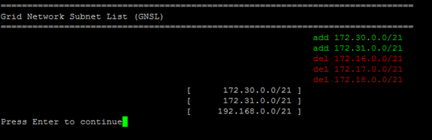

= 在网格网络上添加或更改子网列表
:allow-uri-read: 
:icons: font
:imagesdir: ../media/

[role="lead"]
您可以使用更改 IP 工具在网格网络上添加或更改子网。

.开始之前
* 您已获得 `Passwords.txt`文件。

您可以在网格网络子网列表中添加，删除或更改子网。更改将影响网格中所有节点上的路由。

NOTE: 如果仅更改网格网络子网列表，请使用网格管理器添加或更改网络配置。否则，如果网格管理器因网络配置问题描述 而无法访问，或者您同时执行网格网络路由更改和其他网络更改，请使用更改 IP 工具。

[NOTE]
====
请勿对任何节点的网格网络、管理网络或客户端网络使用包含以下 IPv4 地址的子网：

* 192,168,130,101
* 192,168,131,101
* 192,168,130,102
* 192,168,131,102
* 198.51.100.2
* 198.51.100.4

例如，不要对任何节点的网格网络、管理网络或客户端网络使用以下子网范围：

* 192.168.130.0/24，因为此子网范围包含 IP 地址 192.168.130.101 和 192.168.130.102
* 192.168.131.0/24，因为此子网范围包含 IP 地址 192.168.131.101 和 192.168.131.102
* 198.51.100.0/24，因为此子网范围包含 IP 地址 198.51.100.2 和 198.51.100.4

====
.步骤
. 登录到主管理节点：
+
.. 输入以下命令： `ssh admin@_primary_Admin_Node_IP_`
.. 输入文件中列出的密码 `Passwords.txt`。
.. 输入以下命令切换到root： `su -`
.. 输入文件中列出的密码 `Passwords.txt`。

+
当您以root用户身份登录时，提示符将从更 `$`改为 `#`。

. 输入以下命令、启动更改IP工具： `change-ip`
. 在提示符处输入配置密码短语。
+
此时将显示主菜单。

+
image::../media/change_ip_tool_main_menu.png[显示更改 IP 工具欢迎屏幕的屏幕截图]

. 在主菜单上，选择用于编辑网格网络子网的选项（选项 * 4* ）。
+

NOTE: 对网格网络子网列表所做的更改在网格范围内进行。

. 选择以下选项之一：
+
--
** 输入以下命令以添加子网： `add CIDR`
** 输入以下命令以删除子网： `del CIDR`
** 输入以下命令以设置子网列表： `set CIDR`

--
+
--

NOTE: 对于所有命令、可以使用以下格式输入多个地址： `add CIDR, CIDR`

示例： `add 172.14.0.0/16, 172.15.0.0/16, 172.16.0.0/16`

TIP: 您可以使用"向上箭头"将先前键入的值重新调用到当前输入提示符中、然后根据需要对其进行编辑、从而减少所需的键入量。

以下示例输入显示了为网格网络子网列表设置子网：

image::../media/change_ip_tool_gnsl_sample_input.gif[周围文本所述的屏幕截图]

--
. 准备好后，输入 * 。 q* 可返回主菜单屏幕。您所做的更改将一直保留，直到清除或应用为止。
. 选择以下选项之一：
+
** 选择选项 * 5* 可显示输出中的编辑内容，而输出中的编辑内容是孤立的，仅显示更改后的项。所做的更改以绿色（添加项）或红色（删除项）突出显示，如以下示例输出所示：
+

** 选择选项 *6* 可在显示完整配置的输出中显示编辑内容。更改将以绿色（添加项）或红色（删除项）突出显示。
+

NOTE: 某些命令行界面可能会使用删除线格式显示添加和删除。

. 选择选项 * 7* 以验证所有暂存更改。
+
此验证可确保遵循网格网络，管理网络和客户端网络的规则，例如使用重叠的子网。

. （可选）选择选项 * 8* 保存所有分阶段更改，稍后返回以继续进行更改。
+
使用此选项，您可以退出更改 IP 工具并稍后重新启动它，而不会丢失任何未应用的更改。

. 执行以下操作之一：
+
** 如果要在不保存或应用新网络配置的情况下清除所有更改，请选择选项 * 。
** 如果您已准备好应用更改并配置新的网络配置，请选择选项 * 。配置期间、输出将显示已应用更新的状态、如以下示例输出所示：
+
[listing]
----
Generating new grid networking description file...

Running provisioning...

Updating grid network configuration on Name
----

. 如果在更改网格网络时选择了选项 * 。 10 ，请选择以下选项之一：
+
** * 应用 * ：立即应用更改，并在必要时自动重新启动每个节点。
+
如果新网络配置将与旧网络配置同时运行而不进行任何外部更改，则可以使用 * 应用 * 选项进行完全自动化的配置更改。

** * 阶段 * ：下次重新启动节点时应用更改。
+
如果要使新网络配置正常运行，需要更改物理或虚拟网络配置，则必须使用 * 阶段 * 选项，关闭受影响的节点，进行必要的物理网络更改并重新启动受影响的节点。

+

NOTE: 如果使用*stag*选项，请在暂存后尽快重新启动节点，以最大限度地减少中断。

** *CANCEL*：目前请勿更改任何网络。
+
如果您不知道建议的更改需要重新启动节点，则可以推迟更改以最大限度地减少对用户的影响。选择 * 取消 * 将返回到主菜单并保留所做的更改，以便稍后应用。

+
应用或暂存更改后、网格配置更改将生成新的恢复软件包。

. 如果配置因错误而停止，则可以使用以下选项：
+
** 要终止IP更改操作步骤 并返回主菜单，请输入*A*。
** 要重试失败的操作，请输入 * 。
** 要继续执行下一个操作，请输入 * c* 。
+
稍后可以从主菜单中选择选项 * 10 * （应用更改）重试失败的操作。只有成功完成所有操作后， IP 更改操作步骤 才会完成。

** 如果您必须手动干预（例如重新启动节点），并确信工具认为失败的操作已实际成功完成，请输入 * f* 将其标记为成功并移至下一操作。

. 从网格管理器下载新的恢复软件包。
+
.. 选择 * 维护 * > * 系统 * > * 恢复软件包 * 。
.. 输入配置密码短语。

+

CAUTION: 恢复包文件必须受到保护，因为它包含可用于从 StorageGRID 系统获取数据的加密密钥和密码。

