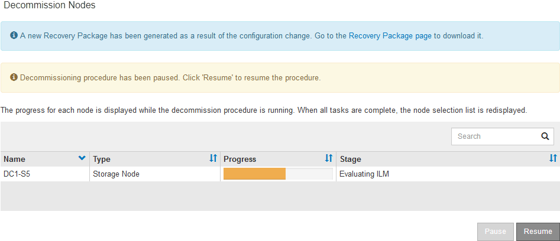

= 暂停和恢复存储节点的停用过程
:allow-uri-read: 
:icons: font
:imagesdir: ../media/

[role="lead"]
如果需要执行第二个维护操作步骤 ，可以在某些阶段暂停存储节点的停用操作步骤 。另一个操作步骤 完成后，您可以恢复停用。

NOTE: 只有在达到 ILM 评估或纠删编码的数据停用阶段时， * 暂停 * 按钮才会启用；但是， ILM 评估（数据迁移）将继续在后台运行。

.开始之前
* 您已使用登录到网格管理器link:../admin/web-browser-requirements.html["支持的 Web 浏览器"]。
* 您拥有link:../admin/admin-group-permissions.html["维护或root访问权限"]。

.步骤
. 选择 * 维护 * > * 任务 * > * 取消配置 * 。
+
此时将显示 Decommission 页面。

. 选择 * 取消配置节点 * 。
+
此时将显示 Decommission Nodes 页面。当停用操作步骤 达到以下任一阶段时， * 暂停 * 按钮将处于启用状态。

+
** 评估 ILM
** 停用经过Erasure编码的数据

. 选择 * 暂停 * 以暂停操作步骤 。
+
当前阶段已暂停，并且 * 恢复 * 按钮已启用。

+

. 另一个维护操作步骤 完成后，选择 * 恢复 * 继续执行停用。

