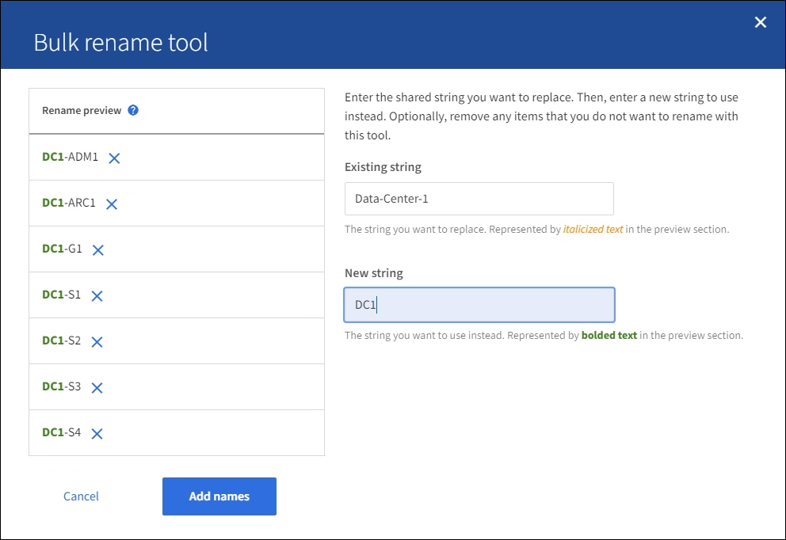

= 添加或更新显示名称
:allow-uri-read: 
:icons: font
:imagesdir: ../media/

[role="lead"]
您可以使用此操作步骤 添加或更新网格、站点和节点所使用的显示名称。您可以同时重命名单个项目、多个项目甚至所有项目。定义或更新显示名称不会以任何方式影响StorageGRID 操作。

.开始之前
* 在*主管理节点*中，您使用登录到网格管理器link:../admin/web-browser-requirements.html["支持的 Web 浏览器"]。
+

NOTE: 您可以从非主管理节点添加或更新显示名称、但必须登录到主管理节点才能下载恢复软件包。

* 您拥有link:../admin/admin-group-permissions.html["维护或root访问权限"]。
* 您具有配置密码短语。
* 您了解显示名称的要求和最佳实践。请参阅。 link:../maintain/rename-grid-site-node-overview.html["重命名网格、站点和节点"]

== 如何重命名网格、站点或节点

您可以重命名StorageGRID 系统、一个或多个站点或一个或多个节点。

您可以使用其他节点先前使用的显示名称、只要重命名不会导致显示名称或系统名称重复即可。

=== 选择要重命名的项目

要开始、请选择要重命名的项目。

.步骤
. 选择*维护*>*任务*>*重命名网格、站点和节点*。
. 在*选择名称*步骤中，选择要重命名的项目。
+
[cols="1a,2a"]
|===
| 要更改的项目 | 说明 

 a| 
系统中所有内容(或几乎所有内容)的名称
 a| 
.. 选择*全选*。
.. (可选)清除不想重命名的任何项目。

 a| 
网格的名称
 a| 
选中网格对应的复选框。

 a| 
站点及其部分或全部节点的名称
 a| 
.. 选中站点的表标题中的复选框。
.. (可选)清除不想重命名的任何节点。

 a| 
站点名称
 a| 
选中站点的复选框。

 a| 
节点名称
 a| 
选中节点对应的复选框。

|===
. 选择 * 继续 * 。
. 查看表格、其中包括您选择的项目。
+
** *显示名称*列显示每个项目的当前名称。如果项目从未重命名，则其显示名称与其系统名称相同。
** “*系统名称*”列显示您在安装过程中为每个项目输入的名称。系统名称用于内部StorageGRID 操作、无法更改。例如、节点的系统名称可能是其主机名。
** “*类型*”列表示项目的类型：网格、站点或特定节点类型。

=== 建议新名称

对于*PROPIN NEW NAMES*步骤，您可以分别为每个项目输入显示名称，也可以批量重命名项目。

[role="tabbed-block"]
====
.单独重命名项目
--
按照以下步骤为要重命名的每个项目输入显示名称。

.步骤
. 在*显示名称*字段中，为列表中的每个项目输入建议的显示名称。
+
请参见link:../maintain/rename-grid-site-node-overview.html["重命名网格、站点和节点"]了解命名要求。

. 要删除不想重命名的任何项目，请在*从列表中删除*列中选择image:../media/icon-x-to-remove.png["X图标"]。
+
如果您不会为项目建议新名称、则必须将其从表中删除。

. 为表中的所有项目建议新名称后，选择*Rename*。
+
此时将显示一条成功消息。现在，网格管理器中将使用新的显示名称。

--
.批量重命名项目
--
如果项目名称共享要替换为其他字符串的通用字符串、请使用批量重命名工具。

.步骤
. 对于“*建议新名称*”步骤，选择“*使用批量重命名工具*”。
+
重命名预览*包括在*PROPURE NEW NAMES*步骤中显示的所有项目。您可以使用预览查看替换共享字符串后显示名称的外观。

. 在*existing string*字段中，输入要替换的共享字符串。例如，如果要替换的字符串为 `Data-Center-1`，请输入*Data-Center-1*。
+
键入时、无论左侧名称中的任何位置、文本都会突出显示。

. 选择image:../media/icon-x-to-remove.png["X图标"]以删除不想使用此工具重命名的任何项目。
+
例如，假设您要重命名包含字符串的所有节点 `Data-Center-1`，但不想重命名 `Data-Center-1`站点本身。选择image:../media/icon-x-to-remove.png["X图标"]以从重命名预览中删除网站。

+
image::../media/rename-bulk-rename-tool.png[批量重命名工具]

. 在*New string*字段中，输入要使用的替换字符串。例如，输入*DC1*。
+
请参见link:../maintain/rename-grid-site-node-overview.html["重命名网格、站点和节点"]了解命名要求。

+
输入替换字符串时、左侧的名称将更新、以便您可以验证新名称是否正确。

+

. 对预览中显示的名称感到满意后，选择*添加名称*将名称添加到表中，以执行*建议新名称*步骤。
. 进行所需的任何其他更改、或选择image:../media/icon-x-to-remove.png["X图标"]删除不想重命名的任何项目。
. 当您准备好重命名表中的所有项目时，选择*Rename*。
+
此时将显示一条成功消息。现在，网格管理器中将使用新的显示名称。

--
====

=== [[download-recovery package]]下载恢复软件包

重命名项目后、下载并保存新的恢复软件包。您重命名的项目的新显示名称将包括在文件中 `Passwords.txt`。

.步骤
. 输入配置密码短语。
. 选择*下载恢复软件包*。
+
下载将立即开始。

. 下载完成后、打开 `Passwords.txt`文件以查看所有节点的服务器名称以及任何已重命名节点的显示名称。
. 将文件复制 `sgws-recovery-package-_id-revision_.zip`到两个安全、独立的位置。
+

CAUTION: 恢复包文件必须受到保护，因为它包含可用于从 StorageGRID 系统获取数据的加密密钥和密码。

. 选择*完成*以返回到第一步。

== 将显示名称还原为系统名称

您可以将重命名的网格、站点或节点还原回其原始系统名称。将项目还原回其系统名称后，网格管理器页面和其他StorageGRID 位置将不再显示该项目的*Display name*。仅显示项目的系统名称。

.步骤
. 选择*维护*>*任务*>*重命名网格、站点和节点*。
. 在*选择名称*步骤中，选择要恢复为系统名称的任何项目。
. 选择 * 继续 * 。
. 对于*PROPIN NEW NAMES*步骤，将显示名称分别或批量还原回系统名称。
+
[role="tabbed-block"]
====
.分别还原为系统名称
--
.. 复制每个项目的原始系统名称并将其粘贴到*显示名称*字段中，或选择image:../media/icon-x-to-remove.png["X图标"]删除不想还原的任何项目。
+
要还原显示名称，系统名称必须显示在*Display name*字段中，但名称不区分大小写。

.. 选择 * 重命名 * 。
+
此时将显示一条成功消息。不再使用这些项目的显示名称。

--
.批量还原为系统名称
--
.. 对于“*建议新名称*”步骤，选择“*使用批量重命名工具*”。
.. 在*existing string*字段中，输入要替换的显示名称字符串。
.. 在*New string*字段中，输入要使用的系统名称字符串。
.. 选择*Add Names*，将名字添加到表中，以执行*PROPIMINGNEW NAMES*步骤。
.. 确认*显示名称*字段中的每个条目都与*系统名称*字段中的名称匹配。进行任何更改或选择image:../media/icon-x-to-remove.png["X图标"]删除不想还原的任何项目。
+
要还原显示名称，系统名称必须显示在*Display name*字段中，但名称不区分大小写。

.. 选择 * 重命名 * 。
+
此时将显示一条成功消息。不再使用这些项目的显示名称。

--
====
. <<download-recovery-package,下载并保存新的恢复软件包>>(英文)
+
您还原的项目的显示名称不再包含在文件中 `Passwords.txt`。

