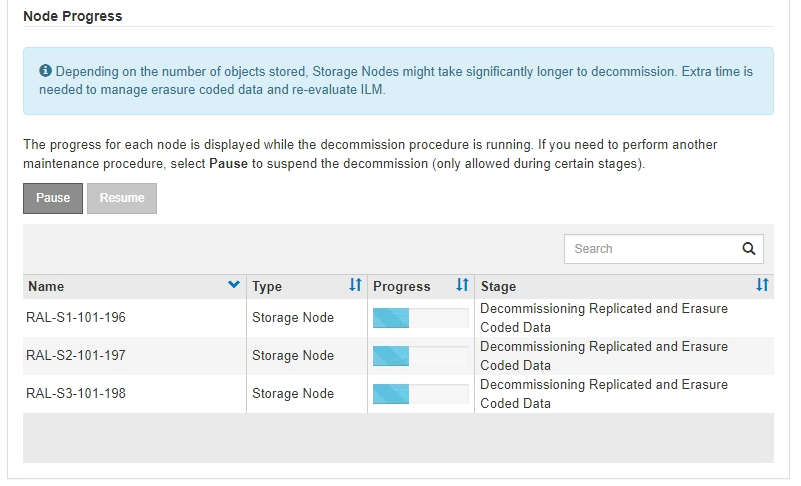

= 第 6 步：监控取消配置
:allow-uri-read: 
:icons: font
:imagesdir: ../media/

[role="lead"]
从 " 取消配置站点 " 页面向导的第 6 步（监控取消配置）中，您可以在删除站点时监控进度。

.关于此任务
当 StorageGRID 删除已连接站点时，它将按以下顺序删除节点：

. 网关节点
. 管理节点
. 存储节点

当 StorageGRID 删除已断开连接的站点时，它会按以下顺序删除节点：

. 网关节点
. 存储节点
. 管理节点

每个网关节点或管理节点可能只需要几分钟或一小时即可删除；但是，存储节点可能需要数天或数周的时间。

.步骤
. 一旦生成新的恢复包，请下载该文件。
+
image::../media/decommission_site_step_6_recovery_package.png[站点退役第 6 步恢复包]

+

NOTE: 尽快下载恢复包，以确保在退役过程中出现问题时可以恢复电网。

+
.. 选择消息中的链接，或选择*维护* > *系统* > *恢复包*。
.. 下载 `.zip`文件。
+
请参阅说明link:downloading-recovery-package.html["下载恢复包"]。

+

NOTE: 恢复包文件必须是安全的，因为它包含可用于从StorageGRID系统获取数据的加密密钥和密码。

. 使用 " 数据移动 " 图表监控对象数据从该站点到其他站点的移动情况。
+
在步骤 3 （修订 ILM 策略）中激活新的 ILM 策略后，数据移动开始。数据移动将在整个停用操作步骤 中进行。

+
image::../media/decommission_site_step_6_data_movement.png[停用站点第 6 步数据移动]

. 在页面的节点进度部分中，在删除节点时监控停用操作步骤 的进度。
+
删除存储节点后，每个节点将经历一系列阶段。尽管其中大多数阶段发生得很快甚至不可能发生，但根据需要移动的数据量，您可能需要等待几天甚至几周才能完成其他阶段。需要更多时间来管理经过纠删编码的数据并重新评估 ILM 。

+

+
如果您正在监控已连接站点停用的进度，请参阅此表以了解存储节点的停用阶段：

+
[cols="1a,2a"]
|===
| 阶段 | 估计持续时间 

 a| 
待定
 a| 
分钟或更短

 a| 
等待锁定
 a| 
分钟

 a| 
准备任务
 a| 
分钟或更短

 a| 
将 LDR 标记为已停用
 a| 
分钟

 a| 
停用复制的和经过Erasure编码的数据
 a| 
小时，天或周，具体取决于数据量

* 注意 * ：如果您需要执行其他维护活动，可以在此阶段暂停站点停用。

 a| 
LDR 设置状态
 a| 
分钟

 a| 
刷新审核队列
 a| 
分钟到小时，具体取决于消息数量和网络延迟。

 a| 
完成
 a| 
分钟

|===
+
如果您要监控已断开连接的站点停用的进度，请参见下表以了解存储节点的停用阶段：

+
[cols="1a,1a"]
|===
| 阶段 | 估计持续时间 

 a| 
待定
 a| 
分钟或更短

 a| 
等待锁定
 a| 
分钟

 a| 
准备任务
 a| 
分钟或更短

 a| 
禁用外部服务
 a| 
分钟

 a| 
证书撤消
 a| 
分钟

 a| 
节点取消注册
 a| 
分钟

 a| 
存储级别取消注册
 a| 
分钟

 a| 
删除存储组
 a| 
分钟

 a| 
实体删除
 a| 
分钟

 a| 
完成
 a| 
分钟

|===
. 在所有节点均已达到完成阶段后，请等待其余站点停用操作完成。
+
** 在 * 修复 Cassandra* 步骤中， StorageGRID 会对网格中保留的 Cassandra 集群进行任何必要的修复。这些修复可能需要几天或更长时间，具体取决于网格中剩余的存储节点数。
+
image::../media/decommission_site_step_6_repair_cassandra.png[停用站点步骤 6 修复 Cassandra]

** 在 * 停用 EC 配置文件并删除存储池 * 步骤中，将进行以下 ILM 更改：
+
*** 任何引用站点的纠删编码配置文件都将被停用。
*** 系统将删除引用此站点的任何存储池。
+

NOTE: 所有存储节点存储池(StorageGRID 11.6及更早版本)也会被删除、因为它会使用所有站点站点。

** 最后，在 * 删除配置 * 步骤中，对站点及其节点的任何剩余引用都将从网格的其余部分中删除。
+
image::../media/decommission_site_step_6_remove_configuration.png[停用站点步骤 6 删除配置]

. 停用操作步骤 完成后， " 停用站点 " 页面将显示一条成功消息，并且不再显示已删除的站点。
+
image::../media/decommission_site_success_message.png[停用站点成功消息]

.完成后
完成站点停用操作步骤 后，完成以下任务：

* 确保已擦除已停用站点中所有存储节点的驱动器。使用商用数据擦除工具或服务永久安全地从驱动器中删除数据。
* 如果此站点包含一个或多个管理节点，并且已为您的 StorageGRID 系统启用单点登录（ SSO ），请从 Active Directory 联合身份验证服务（ AD FS ）中删除此站点的所有依赖方信任。
* 在已连接站点停用操作步骤 期间正常关闭节点后，请删除关联的虚拟机。

