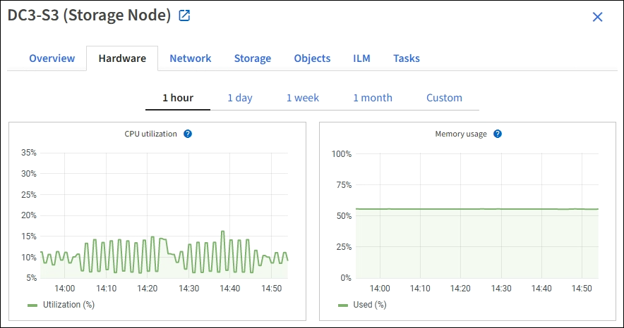

= 监控网络和系统资源
:allow-uri-read: 
:icons: font
:imagesdir: ../media/

[role="lead"]
节点和站点之间网络的完整性和带宽以及各个网格节点的资源使用情况对于高效运营至关重要。

== 监控网络连接和性能

如果您的信息生命周期管理（ ILM ）策略使用提供站点丢失保护的方案在站点之间复制复制复制的对象或存储经过纠删编码的对象，则网络连接和带宽尤其重要。如果站点之间的网络不可用，网络延迟过高或网络带宽不足，则某些 ILM 规则可能无法将对象放置在预期位置。如果为ILM规则选择了严格的写入选项、则可能会导致写入失败、或者导致写入性能不佳和ILM积压。

使用网格管理器监控连接和网络性能、以便及时解决任何问题。

此外、请考虑link:../admin/managing-traffic-classification-policies.html["创建网络流量分类策略"]监控与特定租户、分段、子网或负载平衡器端点相关的流量。您可以根据需要设置流量限制策略。

.步骤
. 选择 * 节点 * 。
+
此时将显示节点页面。网格中的每个节点均以表格式列出。

+
image::../media/nodes_menu.png[节点菜单]

. 选择网格名称，特定数据中心站点或网格节点，然后选择 * 网络 * 选项卡。
+
网络流量图提供了整个网格，数据中心站点或节点的整体网络流量摘要。

+
image::../media/nodes_page_network_traffic_graph.png[节点页面网络流量图]

+
.. 如果选择了网格节点，请向下滚动以查看页面的 * 网络接口 * 部分。
+
image::../media/nodes_page_network_interfaces.png[节点页面网络接口]

.. 对于网格节点，向下滚动以查看页面的 * 网络通信 * 部分。
+
接收和传输表显示了通过每个网络接收和发送的字节数和数据包数，以及其他接收和传输指标。

+
image::../media/nodes_page_network_communication.png[节点页面网络通信]

. 使用与流量分类策略关联的指标监控网络流量。
+
.. 选择 * 配置 * > * 网络 * > * 流量分类 * 。
+
此时将显示 " 流量分类策略 " 页面，并在表中列出现有策略。

+
image::../media/traffic_classification_policies_main_screen_w_examples.png[图形的流量策略示例]

.. 要查看显示与策略关联的网络指标的图形，请选择策略左侧的单选按钮，然后单击 * 指标 * 。
.. 查看图形以了解与策略关联的网络流量。
+
如果流量分类策略旨在限制网络流量，请分析流量限制的频率，并确定该策略是否仍能满足您的需求。不时地，link:../admin/managing-traffic-classification-policies.html["根据需要调整每个流量分类策略"].

.相关信息
* link:viewing-network-tab.html["查看网络选项卡"]
* link:monitoring-system-health.html#monitor-node-connection-states["监控节点连接状态"]

== 监控节点级资源

监控各个网格节点以检查其资源使用情况。如果节点始终过载，则可能需要更多节点才能高效运行。

.步骤
. 从 * 节点 * 页面中，选择节点。
. 选择 * 硬件 * 选项卡以显示 CPU 利用率和内存使用情况的图形。
+

. 要显示不同的时间间隔，请选择图表或图形上方的控件之一。您可以显示间隔为 1 小时， 1 天， 1 周或 1 个月的可用信息。您还可以设置自定义间隔，以便指定日期和时间范围。
. 如果节点托管在存储设备或服务设备上，请向下滚动以查看组件表。所有组件的状态均应为"标称"。调查具有任何其他状态的组件。

.相关信息
* link:viewing-hardware-tab.html#view-information-about-appliance-storage-nodes["查看有关设备存储节点的信息"]
* link:viewing-hardware-tab.html#view-information-about-appliance-admin-nodes-and-gateway-nodes["查看有关设备管理节点和网关节点的信息"]

