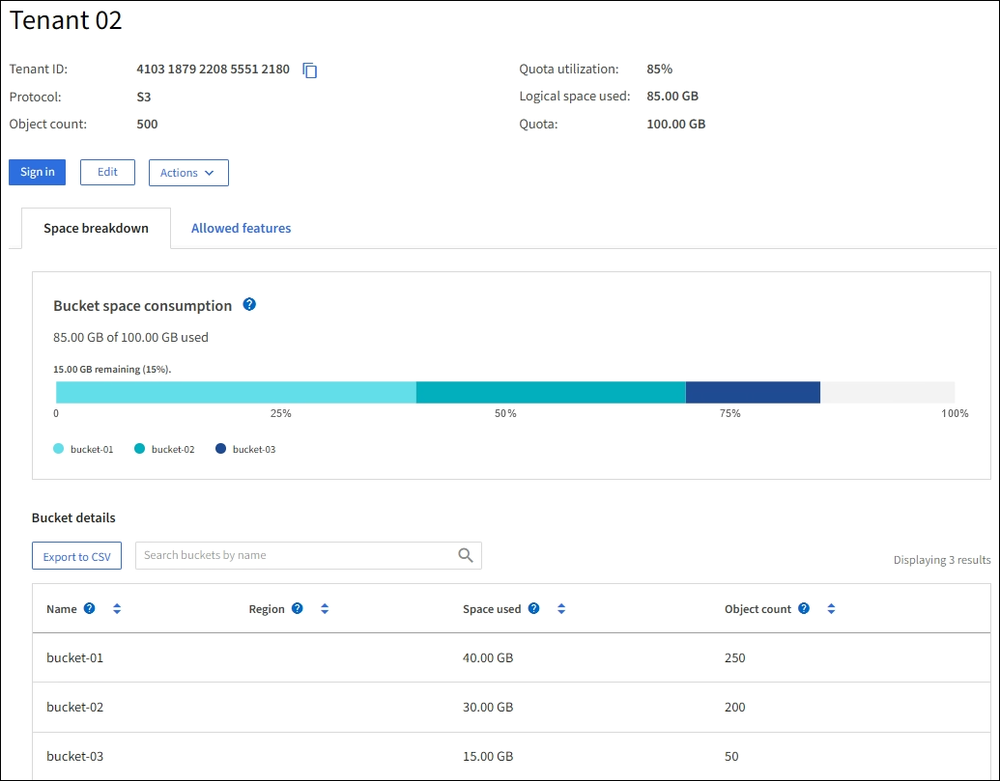

= 监控租户活动
:allow-uri-read: 
:icons: font
:imagesdir: ../media/

[role="lead"]
所有S3客户端活动都与StorageGRID租户帐户相关联。您可以使用网格管理器监控所有租户或特定租户的存储使用情况或网络流量。您可以使用审核日志或Grafana信息板收集有关租户如何使用StorageGRID 的更多详细信息。

.开始之前
* 您已使用登录到网格管理器link:../admin/web-browser-requirements.html["支持的 Web 浏览器"]。
* 您拥有link:../admin/admin-group-permissions.html["root访问权限或租户帐户权限"]。

== 查看所有租户

租户页面显示所有当前租户帐户的基本信息。

.步骤
. 选择*租户*。
. 查看租户页面上显示的信息。
+
此时将列出每个租户的已用逻辑空间、配额使用量、配额和对象计数。如果未为租户设置配额、则配额使用量和配额字段包含短划线(&&#8212；)。

+

NOTE: 属于该租户的所有对象的逻辑大小包括未完成和正在进行的分段上传。该大小不包括用于 ILM 策略的额外物理空间。已用空间值是估计值。这些估计受到摄取时间、网络连接和节点状态的影响。

+
image::../media/tenant_accounts_page.png[租户帐户页面]

. (可选)通过选择*登录/复制URL*列中的登录链接登录到租户帐户image:../media/icon_tenant_sign_in.png["租户登录图标"]。
. (可选)通过选择*登录/复制URL*列中的复制URL链接、复制租户登录页面的URLimage:../media/icon_tenant_copy_url.png["租户副本 URL 图标"]。
. (可选)选择*导出至CSV-*以查看和导出 `.csv`包含所有租户的使用量值的文件。
+
系统将提示您打开或保存 `.csv`文件。

+
此文件的内容 `.csv`类似于以下示例：

+
image::../media/tenant_accounts_example_csv.png[租户帐户示例 .csv]

+
您可以在电子表格应用程序中打开该文件、也可以 `.csv`在自动化中使用它。

. 如果未列出任何对象，也可以选择*Actions*>*Delete*以删除一个或多个租户。请参阅。 link:../admin/deleting-tenant-account.html["删除租户帐户"]
+
如果租户帐户包含任何分段或容器、则不能删除该帐户。

== 查看特定租户

您可以查看特定租户的详细信息。

.步骤
. 从租户页面中选择租户名称。
+
此时将显示租户详细信息页面。

+

. 查看页面顶部的租户概述。
+
此部分详细信息页面提供了租户的摘要信息、包括租户的对象计数、配额使用量、已用逻辑空间和配额设置。

+

NOTE: 属于该租户的所有对象的逻辑大小包括未完成和正在进行的分段上传。该大小不包括用于 ILM 策略的额外物理空间。已用空间值是估计值。这些估计受到摄取时间、网络连接和节点状态的影响。

. 在*空间细分*选项卡中，查看*空间消耗*图表。
+
此图表显示租户的所有S3存储分段的总空间消耗。

+
如果为此租户设置了配额，则已用配额量和剩余配额量将以文本形式显示(例如 `85.00 GB of 100 GB used`)。如果未设置任何配额，则租户具有无限配额，并且文本仅包含已用空间量(例如 `85.00 GB used`)。条形图显示每个分段或容器中的配额百分比。如果租户超过存储配额 1% 以上且至少超过 1 GB ，则此图表将显示总配额和超额量。

+
您可以将光标置于条形图上方，以查看每个分段或容器使用的存储。您可以将光标置于可用空间段上方以查看剩余存储配额量。

+
image::../media/tenant_bucket_space_consumption_GM.png[租户存储分段使用情况条形图]

+

CAUTION: 配额使用量基于内部估计值、在某些情况下可能会超过此值。例如，当租户开始上传对象时， StorageGRID 会检查配额，如果租户超过配额，则会拒绝新的载入。但是，在确定是否超过配额时， StorageGRID 不会考虑当前上传的大小。如果删除了对象、则可能会暂时阻止租户上传新对象、直到重新计算配额使用量为止。计算配额使用量可能需要10分钟或更长时间。

+

NOTE: 租户的配额使用量指示租户上传到StorageGRID的对象数据量(逻辑大小)。配额使用量并不表示用于存储这些对象及其元数据副本的空间(物理大小)。

+

NOTE: 您可以启用*租户配额使用量高*警报规则来确定租户是否正在使用其配额。如果启用，则在租户已使用其配额的 90% 时触发此警报。有关说明，请参阅link:../monitor/editing-alert-rules.html["编辑警报规则"]。

. 在*空间细分*选项卡中、查看*存储分段详细信息*。
+
此表列出了租户的S3存储分段。已用空间是指存储分段或容器中的对象数据总量。此值不表示 ILM 副本和对象元数据所需的存储空间。

. 或者，也可以选择 * 导出到 CSV* 以查看和导出包含每个分段或容器的使用量值的 .csv 文件。
+
单个S3租户文件的内容 `.csv`类似于以下示例：

+
image::../media/tenant_bucket_details_csv.png[租户存储分段详细信息 CSV 示例]

+
您可以在电子表格应用程序中打开该文件、也可以 `.csv`在自动化中使用它。

. (可选)选择*允许的功能*选项卡以查看为租户启用的权限和功能列表。如果需要更改其中任何设置、请参见link:../admin/editing-tenant-account.html["编辑租户帐户"]。
. 如果租户具有*使用网格联合连接*权限，则可以选择*网格联合*选项卡以了解有关连接的更多信息。
+
请参阅link:../admin/grid-federation-overview.html["什么是网格联合？"]和link:../admin/grid-federation-manage-tenants.html["管理网格联盟允许的租户"]。

== 查看网络流量

如果某个租户已设置流量分类策略，请查看该租户的网络流量。

.步骤
. 选择*配置* > *网络* > *流量分类*。
+
此时将显示 " 流量分类策略 " 页面，并在表中列出现有策略。

. 查看策略列表以确定适用于特定租户的策略。
. 要查看与策略关联的指标，请选择策略左侧的单选按钮，然后选择*Metrics*。
. 分析图形以确定策略限制流量的频率以及是否需要调整策略。

有关详细信息、请参见 link:../admin/managing-traffic-classification-policies.html["管理流量分类策略"] 。

== 使用审核日志

您也可以使用审核日志更精细地监控租户的活动。

例如，您可以监控以下类型的信息：

* 特定客户端操作，例如 PUT ， GET 或 DELETE
* 对象大小
* 应用于对象的 ILM 规则
* 客户端请求的源 IP

审核日志会写入文本文件，您可以使用所选的日志分析工具进行分析。这样，您可以更好地了解客户活动，或者实施复杂的成本分摊和计费模式。

有关详细信息、请参见 link:../audit/index.html["查看审核日志"] 。

== 使用Prometheus指标

(可选)使用Prometheus指标报告租户活动。

* 在网格管理器中，选择*支持* > *工具* > *指标*。您可以使用现有的仪表板（例如 S3 概览）来查看客户活动。
+

NOTE: 指标页面上提供的工具主要供技术支持使用。这些工具中的某些功能和菜单项会有意失效。

* 在网格管理器的顶部，选择帮助图标，然后选择*API documents*。您可以使用网格管理 API 的 " 指标 " 部分中的指标为租户活动创建自定义警报规则和信息板。

有关详细信息、请参见 link:reviewing-support-metrics.html["查看支持指标"] 。
