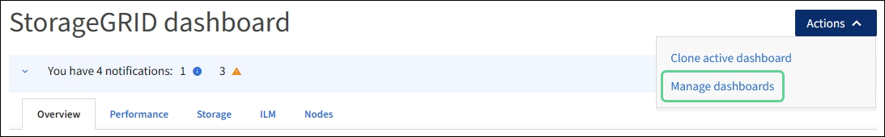
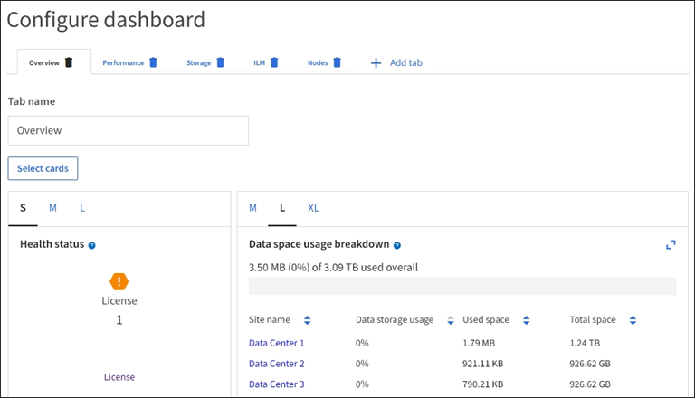

= 查看和管理信息板
:allow-uri-read: 
:icons: font
:imagesdir: ../media/

[role="lead"]
您可以使用信息板一目了然地监控系统活动。您可以创建自定义信息板来监控StorageGRID 的实施。

TIP: 要更改网格管理器中显示的存储值的单位，请选择网格管理器右上角的用户下拉列表，然后选择*用户首选项*。

您的信息板可能会因系统配置而有所不同。

image::../media/grid_manager_dashboard.png[网格管理器信息板]

== 查看信息板

信息板包含多个选项卡、其中包含有关StorageGRID 系统的特定信息。每个选项卡都包含卡片上显示的信息类别。

您可以按原样使用系统提供的信息板。此外、您还可以创建仅包含与监控StorageGRID 实施相关的选项卡和卡片的自定义信息板。

系统提供的信息板选项卡包含具有以下类型信息的卡：

[cols="1a,3a"]
|===
| 选项卡 | 包含 

 a| 
概述
 a| 
有关网格的常规信息、例如活动警报、空间使用量和网格中的总对象数。

 a| 
性能
 a| 
空间使用量、一段时间内使用的存储、S3操作、请求持续时间、错误率。

 a| 
存储
 a| 
租户配额使用量和逻辑空间使用量。预测用户数据和元数据的空间使用量。

 a| 
ILM
 a| 
信息生命周期管理队列和评估率。

 a| 
节点
 a| 
按节点显示的CPU、数据和内存使用情况。按节点执行S3操作。节点到站点分布。

|===
某些卡可以最大化、以便于查看。选择卡右上角的最大化图标image:../media/icon_dashboard_card_maximize.png["最大化图标"]。要关闭已最大化的卡，请选择最小化图标image:../media/icon_dashboard_card_minimize.png["最小化图标"]或选择*关闭*。

== 管理信息板

如果您具有root访问权限(请参见link:../admin/admin-group-permissions.html["管理组权限"])，则可以对信息板执行以下管理任务：

* 从头开始创建自定义信息板。您可以使用自定义信息板控制显示的StorageGRID 信息以及该信息的组织方式。
* 克隆信息板以创建自定义信息板。
* 为用户设置活动信息板。活动信息板可以是系统提供的信息板、也可以是自定义信息板。
* 设置默认信息板、除非用户激活自己的信息板、否则所有用户都会看到该信息板。
* 编辑信息板名称。
* 编辑信息板以添加或删除选项卡和卡。您至少可以有1个选项卡、最多可以有20个选项卡。
* 删除信息板。

NOTE: 如果您拥有除root访问权限之外的任何其他权限、则只能设置活动信息板。

要管理信息板，请选择*Actions*>*Manage Dards*。

== 配置信息板

要通过克隆活动信息板来创建新信息板，请选择*Actions*>*Clone active DDashboard *。

要编辑或克隆现有信息板，请选择*Actions*>*Manage Dards*。

NOTE: 无法编辑或删除系统提供的信息板。

配置信息板时、您可以：

* 添加或删除选项卡
* 重命名选项卡并为新选项卡指定唯一名称
* 为每个选项卡添加、删除或重新排列(拖动)卡片
* 选择卡片顶部的*S*、*M*、*L*或*XL*，选择单张卡片的大小

