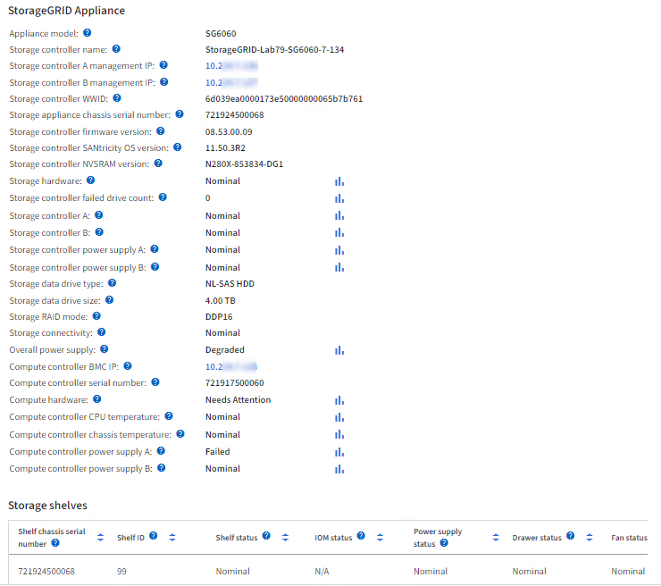

= 查看硬件选项卡
:allow-uri-read: 
:icons: font
:imagesdir: ../media/

[role="lead"]
硬件选项卡可显示每个节点的 CPU 利用率和内存使用情况，以及有关设备的其他硬件信息。

NOTE: Grid Manager随每个版本更新、可能与此页面上的示例屏幕截图不匹配。

此时将显示所有节点的硬件选项卡。

image::../media/nodes_page_hardware_tab_graphs.png[节点页面硬件选项卡]

要显示不同的时间间隔，请选择图表或图形上方的控件之一。您可以显示间隔为 1 小时， 1 天， 1 周或 1 个月的可用信息。您还可以设置自定义间隔，以便指定日期和时间范围。

要查看CPU利用率和内存使用情况的详细信息、请将光标置于每个图形上方。

image::../media/nodes_page_memory_usage_details.png[节点页面 > 硬件 > 内存使用情况详细信息]

如果节点是设备节点，则此选项卡还会包含一个部分，其中包含有关设备硬件的详细信息。

== 查看有关设备存储节点的信息

节点页面列出了有关每个设备存储节点的服务运行状况以及所有计算，磁盘设备和网络资源的信息。您还可以查看内存，存储硬件，控制器固件版本，网络资源，网络接口， 网络地址以及接收和传输数据。

.步骤
. 从节点页面中，选择设备存储节点。
. 选择 * 概述 * 。
+
" 概述 " 选项卡的 " 节点信息 " 部分显示节点的摘要信息，例如节点的名称，类型， ID 和连接状态。IP 地址列表包括每个地址的接口名称，如下所示：

+
** * eth * ：网格网络，管理网络或客户端网络。
** * hic* ：设备上的一个物理 10 ， 25 或 100 GbE 端口。这些端口可以绑定在一起，并连接到 StorageGRID 网格网络（ eth0 ）和客户端网络（ eth2 ）。
** * MTC* ：设备上的一个物理 1 GbE 端口。一个或多个 MTC 接口已绑定，以构成 StorageGRID 管理网络接口（ eth1 ）。您可以保留其他 MTC 接口，以便数据中心的技术人员临时进行本地连接。
+
image::../media/nodes_page_overview_tab_extended.png[扩展了节点页面概述]

+
" 概述 " 选项卡的 " 警报 " 部分显示节点的任何活动警报。

. 选择 * 硬件 * 可查看有关此设备的详细信息。
+
.. 查看 CPU 利用率和内存图形，确定 CPU 和内存使用量随时间的变化所占百分比。要显示不同的时间间隔，请选择图表或图形上方的控件之一。您可以显示间隔为 1 小时， 1 天， 1 周或 1 个月的可用信息。您还可以设置自定义间隔，以便指定日期和时间范围。
+
image::../media/nodes_page_hardware_tab_graphs.png[硬件图形]

.. 向下滚动以查看设备组件表。此表包含设备的型号名称，控制器名称，序列号和 IP 地址以及每个组件的状态等信息。
+

NOTE: 某些字段（例如计算控制器 BMC IP 和计算硬件）仅针对具有此功能的设备显示。

+
存储架和扩展架（如果是安装的一部分）的组件会显示在设备表下方的单独表中。

+

+
[cols="1a,2a"]
|===
| 字段 | 说明 

 a| 
设备型号
 a| 
SANtricity OS中显示的此StorageGRID 设备的型号。

 a| 
存储控制器名称
 a| 
SANtricity OS中显示的此StorageGRID 设备的名称。

 a| 
存储控制器 A 管理 IP
 a| 
存储控制器A上管理端口1的IP地址。您可以使用此IP访问SANtricity操作系统来解决存储问题。

 a| 
存储控制器 B 的管理 IP
 a| 
存储控制器B上管理端口1的IP地址。您可以使用此IP访问SANtricity操作系统来解决存储问题。

某些设备型号没有存储控制器B

 a| 
存储控制器 WWID
 a| 
SANtricity 操作系统中显示的存储控制器的全球通用标识符。

 a| 
存储设备机箱序列号
 a| 
设备的机箱序列号。

 a| 
存储控制器固件版本
 a| 
此设备的存储控制器上的固件版本。

 a| 
存储控制器SANtricity操作系统版本
 a| 
存储控制器A的SANtricity操作系统版本

 a| 
存储控制器NVstoragean版本
 a| 
系统管理器报告的存储控制器的SANtricity版本。

对于SG6060和SG6160、如果这两个控制器之间的NVSG版本不匹配、则会显示控制器A的版本。如果控制器A未安装或未正常运行、则会显示控制器B的版本。

 a| 
存储硬件
 a| 
存储控制器硬件的整体状态。如果 SANtricity System Manager 报告存储硬件的状态为 "Needs Attention （需要注意） " ，则 StorageGRID 系统也会报告此值。

如果状态为"需要引起注意"、请首先使用SANtricity操作系统检查存储控制器。然后、确保不存在适用于此计算控制器的其他警报。

 a| 
存储控制器故障驱动器计数
 a| 
不是最佳驱动器的数量。

 a| 
存储控制器 A
 a| 
存储控制器 A 的状态

 a| 
存储控制器 B
 a| 
存储控制器B的状态。某些设备型号没有存储控制器B

 a| 
存储控制器电源 A
 a| 
存储控制器的电源 A 的状态。

 a| 
存储控制器电源 B
 a| 
存储控制器的电源 B 的状态。

 a| 
存储数据驱动器类型
 a| 
设备中的驱动器类型、例如HDD (硬盘驱动器)或SSD (固态驱动器)。

 a| 
存储数据驱动器大小
 a| 
一个数据驱动器的有效大小。

对于SG6160、还会显示缓存驱动器的大小。

*注意*：对于带有扩展架的节点、请改用<<shelf_data_drive_size,每个磁盘架的数据驱动器大小>>。有效驱动器大小可能因磁盘架而异。

 a| 
存储 RAID 模式
 a| 
为设备配置的 RAID 模式。

 a| 
存储连接
 a| 
存储连接状态。

 a| 
整体电源
 a| 
设备的所有电源的状态。

 a| 
计算控制器 BMC IP
 a| 
计算控制器中的基板管理控制器（ Baseboard Management Controller ， BMC ）端口的 IP 地址。您可以使用此 IP 连接到 BMC 界面来监控和诊断设备硬件。

对于不包含BMC的设备型号、不会显示此字段。

 a| 
计算控制器序列号
 a| 
计算控制器的序列号。

 a| 
计算硬件
 a| 
计算控制器硬件的状态。对于没有单独计算硬件和存储硬件的设备型号、不会显示此字段。

 a| 
计算控制器 CPU 温度
 a| 
计算控制器 CPU 的温度状态。

 a| 
计算控制器机箱温度
 a| 
计算控制器的温度状态。

|===
+
[cols="1a,2a"]
|===
| 存储架表中的列 | 说明 

 a| 
磁盘架机箱序列号
 a| 
存储架机箱的序列号。

 a| 
磁盘架 ID
 a| 
存储架的数字标识符。

*** 99 ：存储控制器架
*** 0 ：第一个扩展架
*** 1 ：第二个扩展架

*注：*扩展架仅适用于SG6060和SG6160。

 a| 
磁盘架状态
 a| 
存储架的整体状态。

 a| 
IOM状态
 a| 
任何扩展架中的输入 / 输出模块（ IOM ）的状态。不适用于扩展架。

 a| 
电源状态
 a| 
存储架电源的整体状态。

 a| 
抽盒状态
 a| 
存储架中抽盒的状态。不适用，如果磁盘架不包含抽盒。

 a| 
风扇状态
 a| 
存储架中的散热风扇的整体状态。

 a| 
驱动器插槽
 a| 
存储架中的驱动器插槽总数。

 a| 
数据驱动器
 a| 
存储架中用于数据存储的驱动器数量。

 a| 
【磁盘架数据驱动器大小】数据驱动器大小
 a| 
存储架中一个数据驱动器的有效大小。

 a| 
缓存驱动器
 a| 
存储架中用作缓存的驱动器数量。

 a| 
缓存驱动器大小
 a| 
存储架中最小缓存驱动器的大小。通常，缓存驱动器的大小相同。

 a| 
配置状态
 a| 
存储架的配置状态。

|===
.. 确认所有状态均为"标称"。
+
如果状态不是"标称"、请查看任何当前警报。您还可以使用 SANtricity 系统管理器详细了解其中一些硬件值。请参见有关安装和维护设备的说明。

. 选择 * 网络 * 可查看每个网络的信息。
+
网络流量图提供了整体网络流量的摘要。

+
image::../media/nodes_page_network_traffic_graph.png[节点页面网络流量图]

+
.. 查看网络接口部分。
+
image::../media/nodes_page_network_interfaces.png[节点页面网络接口]

+
使用下表以及网络接口表中 * 速度 * 列中的值确定设备上的 10/225-GbE 网络端口是配置为使用主动 / 备份模式还是 LACP 模式。

+

NOTE: 表中显示的值假定使用了所有四个链路。

+
[cols="1a,1a,1a,1a"]
|===
| 链路模式 | 绑定模式 | 单个 HIC 链路速度（ hic1 ， hic2 ， hic3 ， hic4 ） | 预期网格 / 客户端网络速度（ eth0 ， eth2 ） 

 a| 
聚合
 a| 
LACP
 a| 
25
 a| 
100

 a| 
已修复
 a| 
LACP
 a| 
25
 a| 
50

 a| 
已修复
 a| 
主动 / 备份
 a| 
25
 a| 
25

 a| 
聚合
 a| 
LACP
 a| 
10
 a| 
40

 a| 
已修复
 a| 
LACP
 a| 
10
 a| 
20

 a| 
已修复
 a| 
主动 / 备份
 a| 
10
 a| 
10

|===
+
有关配置10/C5-GbE端口的详细信息、请参见 https://docs.netapp.com/us-en/storagegrid-appliances/installconfig/configuring-network-links.html["配置网络链路"^]。

.. 查看网络通信部分。
+
接收和传输表显示了通过每个网络接收和发送的字节数和数据包数，以及其他接收和传输指标。

+
image::../media/nodes_page_network_communication.png[节点页面网络通信]

. 选择 * 存储 * 可查看显示对象数据和对象元数据在一段时间内所用存储百分比的图形，以及有关磁盘设备，卷和对象存储的信息。
+
image::../media/nodes_page_storage_used_object_data.png[已用存储—对象数据]

+
image::../media/storage_used_object_metadata.png[已用存储—对象元数据]

+
.. 向下滚动以查看每个卷和对象存储的可用存储容量。
+
每个磁盘的全球通用名称与在SANtricity OS (连接到设备存储控制器的管理软件)中查看标准卷属性时显示的卷全球通用标识符(WWID)匹配。

+
为了帮助您解释与卷挂载点相关的磁盘读取和写入统计信息，磁盘设备表的 * 名称 * 列（即 _sdc_ ， _sdd_ ， _sde_ 等）中显示的名称的第一部分与卷表的 * 设备 * 列中显示的值匹配。

+
image::../media/nodes_page_storage_tables.png[节点页面存储表]

== 查看有关设备管理节点和网关节点的信息

节点页面列出了有关用作管理节点或网关节点的每个服务设备的服务运行状况以及所有计算，磁盘设备和网络资源的信息。您还可以查看内存，存储硬件，网络资源，网络接口，网络地址， 以及接收和传输数据。

.步骤
. 从节点页面中，选择设备管理节点或设备网关节点。
. 选择 * 概述 * 。
+
" 概述 " 选项卡的 " 节点信息 " 部分显示节点的摘要信息，例如节点的名称，类型， ID 和连接状态。IP 地址列表包括每个地址的接口名称，如下所示：

+
** * adllb* 和 * adlli* ：如果对管理网络接口使用主动 / 备份绑定，则显示此信息
** * eth * ：网格网络，管理网络或客户端网络。
** * hic* ：设备上的一个物理 10 ， 25 或 100 GbE 端口。这些端口可以绑定在一起，并连接到 StorageGRID 网格网络（ eth0 ）和客户端网络（ eth2 ）。
** * MTC* ：设备上的一个物理 1-GbE 端口。一个或多个 MTC 接口已绑定，以构成管理网络接口（ eth1 ）。您可以保留其他 MTC 接口，以便数据中心的技术人员临时进行本地连接。
+
image::../media/nodes_page_overview_tab_services_appliance.png[服务设备的节点页面概述选项卡]

+
" 概述 " 选项卡的 " 警报 " 部分显示节点的任何活动警报。

. 选择 * 硬件 * 可查看有关此设备的详细信息。
+
.. 查看 CPU 利用率和内存图形，确定 CPU 和内存使用量随时间的变化所占百分比。要显示不同的时间间隔，请选择图表或图形上方的控件之一。您可以显示间隔为 1 小时， 1 天， 1 周或 1 个月的可用信息。您还可以设置自定义间隔，以便指定日期和时间范围。
+
image::../media/nodes_page_hardware_tab_graphs_services_appliance.png[服务设备的节点页面硬件选项卡图形]

.. 向下滚动以查看设备组件表。此表包含型号名称，序列号，控制器固件版本以及每个组件的状态等信息。
+
image::../media/nodes_page_hardware_tab_services_appliance.png[服务设备的节点页面硬件选项卡]

+
[cols="1a,2a"]
|===
| 字段 | 说明 

 a| 
设备型号
 a| 
此 StorageGRID 设备的型号。

 a| 
存储控制器故障驱动器计数
 a| 
不是最佳驱动器的数量。

 a| 
存储数据驱动器类型
 a| 
设备中的驱动器类型、例如HDD (硬盘驱动器)或SSD (固态驱动器)。

 a| 
存储数据驱动器大小
 a| 
一个数据驱动器的有效大小。

 a| 
存储 RAID 模式
 a| 
设备的 RAID 模式。

 a| 
整体电源
 a| 
设备中所有电源的状态。

 a| 
计算控制器 BMC IP
 a| 
计算控制器中的基板管理控制器（ Baseboard Management Controller ， BMC ）端口的 IP 地址。您可以使用此 IP 连接到 BMC 界面来监控和诊断设备硬件。

对于不包含BMC的设备型号、不会显示此字段。

 a| 
计算控制器序列号
 a| 
计算控制器的序列号。

 a| 
计算硬件
 a| 
计算控制器硬件的状态。

 a| 
计算控制器 CPU 温度
 a| 
计算控制器 CPU 的温度状态。

 a| 
计算控制器机箱温度
 a| 
计算控制器的温度状态。

|===
.. 确认所有状态均为"标称"。
+
如果状态不是"标称"、请查看任何当前警报。

. 选择 * 网络 * 可查看每个网络的信息。
+
网络流量图提供了整体网络流量的摘要。

+
image::../media/nodes_page_network_traffic_graph.png[节点页面网络流量图]

+
.. 查看网络接口部分。
+
image::../media/nodes_page_hardware_tab_network_services_appliance.png[节点页面硬件选项卡网络服务设备]

+
使用下表以及网络接口表中 * 速度 * 列中的值确定设备上的四个 40/100-GbE 网络端口是否配置为使用主动 / 备份模式或 LACP 模式。

+

NOTE: 表中显示的值假定使用了所有四个链路。

+
[cols="1a,1a,1a,1a"]
|===
| 链路模式 | 绑定模式 | 单个 HIC 链路速度（ hic1 ， hic2 ， hic3 ， hic4 ） | 预期网格 / 客户端网络速度（ eth0 ， eth2 ） 

 a| 
聚合
 a| 
LACP
 a| 
100
 a| 
400

 a| 
已修复
 a| 
LACP
 a| 
100
 a| 
200

 a| 
已修复
 a| 
主动 / 备份
 a| 
100
 a| 
100

 a| 
聚合
 a| 
LACP
 a| 
40
 a| 
160

 a| 
已修复
 a| 
LACP
 a| 
40
 a| 
80

 a| 
已修复
 a| 
主动 / 备份
 a| 
40
 a| 
40

|===
.. 查看网络通信部分。
+
接收和传输表显示了通过每个网络接收和发送的字节数和数据包数，以及其他接收和传输指标。

+
image::../media/nodes_page_network_communication.png[节点页面网络通信]

. 选择 * 存储 * 可查看有关服务设备上的磁盘设备和卷的信息。
+
image::../media/nodes_page_storage_tab_services_appliance.png[节点页面存储选项卡服务设备]

