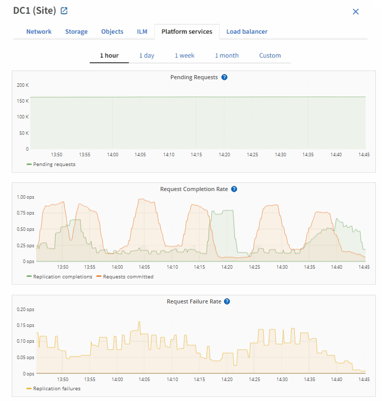

= 查看平台服务选项卡
:allow-uri-read: 
:icons: font
:imagesdir: ../media/

[role="lead"]
平台服务选项卡提供了有关站点上任何 S3 平台服务操作的信息。

此时将显示每个站点的平台服务选项卡。此选项卡提供了有关 S3 平台服务的信息，例如 CloudMirror 复制和搜索集成服务。此选项卡上的图形显示了待处理请求数，请求完成率和请求失败率等指标。

有关S3平台服务的详细信息(包括故障排除详细信息)，请参见link:../admin/index.html["有关管理 StorageGRID 的说明"]。
