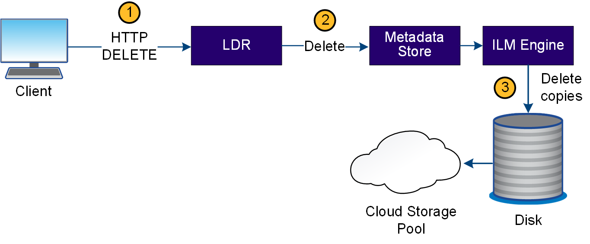

= StorageGRID 如何处理对象删除
:allow-uri-read: 
:icons: font
:imagesdir: ../media/

[role="lead"]
当客户端执行删除操作或对象的生命周期到期时，所有对象副本都会从 StorageGRID 系统中删除，从而触发自动删除。已定义用于删除对象的数据流。

== 删除层次结构

StorageGRID 提供了多种方法来控制何时保留或删除对象。可以根据客户端请求删除对象，也可以自动删除对象。StorageGRID 始终将任何 S3 对象锁定设置优先于客户端删除请求，而客户端删除请求优先于 S3 存储分段生命周期和 ILM 放置说明。

* * S3 对象锁定 * ：如果为网格启用了全局 S3 对象锁定设置，则 S3 客户端可以在启用了 S3 对象锁定的情况下创建存储分段，然后使用 S3 REST API 为添加到存储分段的每个对象版本指定保留日期和合法保留设置。
+
** 无法通过任何方法删除处于合法保留状态的对象版本。
** 在达到对象版本的保留截止日期之前、任何方法都无法删除该版本。
** 启用了S3对象锁定的分段中的对象将由ILM "永久"保留。但是，在达到保留截止日期后，可以通过客户端请求或存储分段生命周期到期来删除对象版本。
** 如果S3客户端对存储分段应用默认的保留截止日期、则无需为每个对象指定保留截止日期。

* *客户端删除请求*：S3客户端可以发出删除对象请求。当客户端删除某个对象时，该对象的所有副本都会从 StorageGRID 系统中删除。
* *删除存储分段中的对象*：租户管理器用户可以使用此选项从StorageGRID 系统中永久删除选定存储分段中的对象和对象版本的所有副本。
* * S3 存储分段生命周期 * ： S3 客户端可以将生命周期配置添加到指定到期操作的存储分段中。如果存储分段生命周期存在，则在满足到期操作中指定的日期或天数时， StorageGRID 会自动删除对象的所有副本，除非客户端先删除该对象。
* * ILM 放置说明 * ：假设存储分段未启用 S3 对象锁定，并且没有存储分段生命周期，则 StorageGRID 会在 ILM 规则中的最后一个时间段结束且没有为此对象指定其他放置时自动删除对象。
+

NOTE: 配置S3存储分段生命周期后、对于与生命周期筛选器匹配的对象、生命周期到期操作将覆盖ILM策略。因此，即使有关放置对象的任何 ILM 指令已失效，该对象也可能会保留在网格中。

有关详细信息、请参见 link:../ilm/how-objects-are-deleted.html["如何删除对象"] 。

== 用于客户端删除的数据流

. LDR 服务从客户端应用程序接收删除请求。
. LDR 服务会更新元数据存储，使对象在客户端请求时看起来已被删除，并指示 ILM 引擎删除对象数据的所有副本。
. 对象将从系统中删除。元数据存储已更新，以删除对象元数据。

== 用于 ILM 删除的数据流

image::../media/automatic_deletion_data_flow.png[自动删除数据流]

. ILM 引擎确定需要删除此对象。
. ILM 引擎会通知元数据存储。元数据存储可更新对象元数据，以便在客户端请求中删除此对象。
. ILM 引擎会删除对象的所有副本。元数据存储已更新，以删除对象元数据。

