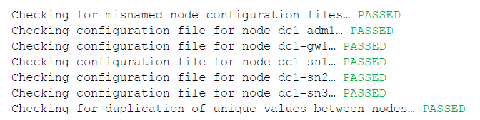

= 验证StorageGRID配置 (Linux)
:allow-uri-read: 
:icons: font
:imagesdir: ../media/

[role="lead"]
在中为每个StorageGRID节点创建配置文件后 `/etc/storagegrid/nodes`、您必须验证这些文件的内容。

NOTE: “Linux”指的是 RHEL、Ubuntu 或 Debian 部署。有关受支持版本的列表，请参阅 https://imt.netapp.com/matrix/#welcome["NetApp 互操作性表工具（ IMT ）"^]。

要验证配置文件的内容，请在每个主机上运行以下命令：

[listing]
----
sudo storagegrid node validate all
----
如果这些文件正确无误，则输出将为每个配置文件显示 * 已通过 * ，如示例所示。

NOTE: 如果在纯元数据节点上仅使用一个LUN、则可能会收到一条警告消息、您可以忽略此消息。

TIP: 对于自动安装，可以使用命令中的或 `--quiet`选项 `storagegrid`(例如 `storagegrid --quiet...`)禁止此输出 `-q`。如果禁止输出，则在检测到任何配置警告或错误时，命令的退出值将为非零。

如果配置文件不正确，则这些问题将显示为 * 警告 * 和 * 错误 * ，如示例所示。如果发现任何配置错误，则必须先更正这些错误，然后再继续安装。

image::../media/rhel_node_configuration_file_output_with_errors.gif[此图通过周围文字进行了说明。]
