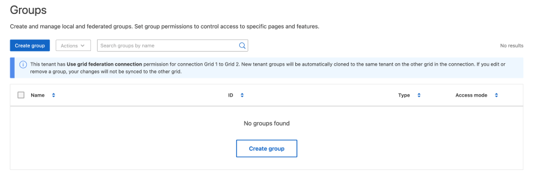

= 为 S3 租户创建组
:allow-uri-read: 
:icons: font
:imagesdir: ../media/

[role="lead"]
您可以通过导入联合组或创建本地组来管理 S3 用户组的权限。

.开始之前
* 您已使用登录到租户管理器link:../admin/web-browser-requirements.html["支持的 Web 浏览器"]。
* 您属于具有的用户组link:tenant-management-permissions.html["root访问权限"]。
* 如果您计划导入联盟组，则已导入link:using-identity-federation.html["已配置身份联合"]，并且已配置的身份源中已存在联盟组。
* 如果您的租户帐户具有*使用网link:grid-federation-account-clone.html["克隆租户组和用户"]格联合连接*权限，则您已查看的工作流和注意事项，并且您已登录到租户的源网格。

== 访问创建组向导

首先、访问创建组向导。

.步骤
. 选择 * 访问管理 * > * 组 * 。
. 如果您的租户帐户具有*使用网格联合连接*权限、请确认显示蓝色横幅、指示在此网格上创建的新组将克隆到连接中另一网格上的同一租户。如果未显示此横幅、则您可能已登录到租户的目标网格。
+

. 选择 * 创建组 * 。

== 选择组类型

您可以创建本地组或导入联合组。

.步骤
. 选择 * 本地组 * 选项卡以创建本地组，或者选择 * 联合组 * 选项卡以从先前配置的身份源导入组。
+
如果为 StorageGRID 系统启用了单点登录（ SSO ），则属于本地组的用户将无法登录到租户管理器，但他们可以根据组权限使用客户端应用程序管理租户的资源。

. 输入组的名称。
+
** * 本地组 * ：输入显示名称和唯一名称。您可以稍后编辑显示名称。
+

NOTE: 如果您的租户帐户具有*使用网格联合连接*权限、并且目标网格上的租户已存在相同的*唯一名称*、则会发生克隆错误。

** * 联合组 * ：输入唯一名称。对于Active Directory、唯一名称是与属性关联的名称 `sAMAccountName`。对于OpenLDAP、唯一名称是与属性关联的名称 `uid`。

. 选择 * 继续 * 。

== 管理组权限

组权限控制用户可在租户管理器和租户管理API中执行的任务。

.步骤
. 对于*Access mode*，请选择以下选项之一：
+
** *读写*(默认)：用户可以登录到租户管理器并管理租户配置。
** * 只读 * ：用户只能查看设置和功能。他们无法在租户管理器或租户管理API中进行任何更改或执行任何操作。本地只读用户可以更改自己的密码。
+

NOTE: 如果用户属于多个组，并且任何组设置为只读，则用户将对所有选定设置和功能具有只读访问权限。

. 为此组选择一个或多个权限。
+
请参阅。 link:../tenant/tenant-management-permissions.html["租户管理权限"]

. 选择 * 继续 * 。

== 设置S3组策略

组策略用于确定用户将拥有哪些S3访问权限。

.步骤
. 选择要用于此组的策略。
+
[cols="1a,2a"]
|===
| 组策略 | 说明 

 a| 
无S3访问
 a| 
默认。此组中的用户无权访问S3资源、除非使用存储分段策略授予访问权限。如果选择此选项，则默认情况下，只有 root 用户才能访问 S3 资源。

 a| 
只读访问
 a| 
此组中的用户对S3资源具有只读访问权限。例如，此组中的用户可以列出对象并读取对象数据，元数据和标记。选择此选项后，只读组策略的 JSON 字符串将显示在文本框中。您无法编辑此字符串。

 a| 
完全访问
 a| 
此组中的用户对S3资源(包括分段)具有完全访问权限。选择此选项后，完全访问组策略的 JSON 字符串将显示在文本框中。您无法编辑此字符串。

 a| 
勒索软件防护
 a| 
此示例策略适用场景此租户的所有分段。此组中的用户可以执行常见操作、但无法从启用了对象版本控制的分段中永久删除对象。

具有*管理所有存储分段*权限的租户管理器用户可以覆盖此组策略。将"管理所有分段"权限限制为受信任用户、并在可用时使用多因素身份验证(Multi-FactorAuthentication、MFA)。

 a| 
自定义
 a| 
组中的用户将被授予您在文本框中指定的权限。

|===
. 如果选择 * 自定义 * ，请输入组策略。每个组策略的大小限制为 5 ， 120 字节。您必须输入有效的 JSON 格式字符串。
+
有关组策略的详细信息(包括语言语法和示例)，请参见link:../s3/example-group-policies.html["组策略示例"]。

. 如果要创建本地组，请选择 * 继续 * 。如果要创建联合组，请选择 * 创建组 * 和 * 完成 * 。

== 添加用户（仅限本地组）

您可以保存组而不添加用户、也可以选择添加任何已存在的本地用户。

NOTE: 如果您的租户帐户具有*使用网格联合连接*权限、则在源网格上创建本地组时选择的任何用户在克隆到目标网格时不会包括在其中。因此、请勿在创建组时选择用户。而是在创建用户时选择组。

.步骤
. 或者，为此组选择一个或多个本地用户。
. 选择 * 创建组 * 和 * 完成 * 。
+
您创建的组将显示在组列表中。

+
如果您的租户帐户具有*使用网格联合连接*权限、而您位于租户的源网格上、则新组将克隆到租户的目标网格。*成功*显示为组详细信息页面的"概述"部分中的*克隆状态*。

