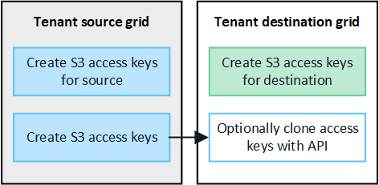

= 克隆租户组和用户
:allow-uri-read: 
:icons: font
:imagesdir: ../media/

[role="lead"]
如果创建或编辑租户以使用网格联合连接、则会将该租户从一个StorageGRID系统(源租户)复制到另一个StorageGRID系统(副本租户)。复制租户后、添加到源租户的任何组和用户都会克隆到副本租户。

最初创建租户的StorageGRID 系统是租户的_ssource grid _。复制租户的StorageGRID 系统是租户的_Destination grid _。这两个租户帐户具有相同的帐户ID、名称、问题描述 、存储配额和已分配权限、 但是、目标租户最初没有root用户密码。有关详细信息，请参见link:../admin/grid-federation-what-is-account-clone.html["什么是帐户克隆"]和link:../admin/grid-federation-manage-tenants.html["管理允许的租户"]。

对于存储分段对象、需要克隆租户帐户信息link:../admin/grid-federation-what-is-cross-grid-replication.html["跨网格复制"]。在两个网格上使用相同的租户组和用户可确保您可以访问任一网格上的相应分段和对象。

== 帐户克隆的租户工作流

如果您的租户帐户具有*使用网格联合连接*权限、请查看工作流示意图、了解克隆组、用户和S3访问密钥要执行的步骤。

image::../media/grid-federation-account-clone-workflow-tm.png[租户的帐户克隆工作流。下面将介绍这些步骤。]

以下是工作流中的主要步骤：

.image:https://raw.githubusercontent.com/NetAppDocs/common/main/media/number-1.png["一个"]登录到租户
[role="quick-margin-para"]
登录到源网格(最初创建租户的网格)上的租户帐户。

.image:https://raw.githubusercontent.com/NetAppDocs/common/main/media/number-2.png["两个"](可选)配置身份联合
[role="quick-margin-para"]
如果您的租户帐户具有*使用自己的身份源*权限来使用联盟组和用户、请为源租户帐户和目标租户帐户配置相同的身份源(设置相同)。除非两个网格使用同一身份源、否则无法克隆联盟组和用户。有关说明，请参阅link:using-identity-federation.html["使用身份联合"]。

.image:https://raw.githubusercontent.com/NetAppDocs/common/main/media/number-3.png["三个"]创建组和用户
[role="quick-margin-para"]
创建组和用户时、请始终从租户的源网格开始。添加新组时、StorageGRID 会自动将其克隆到目标网格。

[role="quick-margin-list"]
* 如果为整个StorageGRID系统或租户帐户配置了身份联合、link:creating-groups-for-s3-tenant.html["创建新租户组"]可通过从身份源导入联合组来实现。

[role="quick-margin-list"]
* 如果您不使用身份联合，link:creating-groups-for-s3-tenant.html["创建新的本地组"]进而link:manage-users.html["创建本地用户"]。

.image:https://raw.githubusercontent.com/NetAppDocs/common/main/media/number-4.png["四个"]创建S3访问密钥
[role="quick-margin-para"]
您可以link:creating-your-own-s3-access-keys.html["创建您自己的访问密钥"]或访问link:creating-another-users-s3-access-keys.html["创建其他用户的访问密钥"]源网格或目标网格上的、以访问该网格上的分段。

.image:https://raw.githubusercontent.com/NetAppDocs/common/main/media/number-5.png["五个"](可选)克隆S3访问密钥
[role="quick-margin-para"]
如果您需要访问两个网格上具有相同访问密钥的分段、请在源网格上创建访问密钥、然后使用租户管理器API手动将其克隆到目标网格。有关说明，请参阅link:../tenant/grid-federation-clone-keys-with-api.html["使用API克隆S3访问密钥"]。

== 如何克隆组、用户和S3访问密钥？

查看本节、了解如何在租户源网格和租户目标网格之间克隆组、用户和S3访问密钥。

=== 克隆在源网格上创建的本地组

创建租户帐户并将其复制到目标网格后、StorageGRID 会自动将您添加到租户源网格的任何本地组克隆到租户的目标网格。

原始组及其克隆具有相同的访问模式、组权限和S3组策略。有关说明，请参阅link:creating-groups-for-s3-tenant.html["为 S3 租户创建组"]。

image::../media/grid-federation-account-clone.png[显示本地组已从源网格克隆到目标网格的图像]

NOTE: 在源网格上创建本地组时选择的任何用户、在将组克隆到目标网格时均不包括在内。因此、请勿在创建组时选择用户。而是在创建用户时选择组。

=== 克隆在源网格上创建的本地用户

当您在源网格上创建新的本地用户时， StorageGRID会自动将该用户克隆到目标网格。原始用户及其克隆用户具有相同的全名、用户名和*拒绝访问*设置。两个用户也属于同一组。有关说明，请参阅link:manage-users.html["管理用户"]。

出于安全原因，本地用户密码不会被克隆到目标网格。如果本地用户需要访问目标网格上的租户管理器，则租户帐户的根用户必须在目标网格上为该用户添加密码。有关说明，请参阅link:manage-users.html["管理用户"]。

image::../media/grid-federation-local-user-clone.png[显示本地用户已从源网格克隆到目标网格的图像]

=== 克隆在源网格上创建的联盟组

假设已满足将帐户克隆与和link:../admin/grid-federation-what-is-account-clone.html#account-clone-identity-federation["身份联合"]结合使用的要求link:../admin/grid-federation-what-is-account-clone.html#account-clone-sso["单点登录"]、则您在源网格上为租户创建(导入)的联盟组将自动克隆到目标网格上的租户。

这两个组具有相同的访问模式、组权限和S3组策略。

为源租户创建联盟组并克隆到目标租户后、联盟用户可以在任一网格上登录到租户。

image::../media/grid-federation-federated-group-clone.png[显示联盟组已从源网格克隆到目标网格的图像]

=== 可以手动克隆S3访问密钥

StorageGRID 不会自动克隆S3访问密钥、因为通过在每个网格上使用不同的密钥可以提高安全性。

要管理两个网格上的访问密钥、您可以执行以下任一操作：

* 如果不需要对每个网格使用相同的键、则可以在每个网格上使用link:creating-your-own-s3-access-keys.html["创建您自己的访问密钥"]或link:creating-another-users-s3-access-keys.html["创建其他用户的访问密钥"]。
* 如果您需要在两个网格上使用相同的密钥、则可以在源网格上创建密钥、然后使用租户管理器API手动link:../tenant/grid-federation-clone-keys-with-api.html["克隆密钥"]访问目标网格。

NOTE: 克隆联盟用户的S3访问密钥时、用户和S3访问密钥都会克隆到目标租户。

=== 添加到目标网格的组和用户不会进行克隆

只会从租户的源网格克隆到租户的目标网格。如果在租户的目标网格上创建或导入组和用户、StorageGRID 不会将这些项克隆回租户的源网格。

image::../media/grid-federation-account-not-cloned.png[显示目标网格上的详细信息未克隆到源网格的图像]

=== 编辑或删除的组、用户和访问密钥不会克隆

只有在创建新组和用户时、才会进行克隆。

如果编辑或删除任一网格上的组、用户或访问密钥、则所做的更改不会克隆到另一个网格。

image::../media/grid-federation-account-clone-edit-delete.png[显示编辑或删除的详细信息不会克隆的图像]
