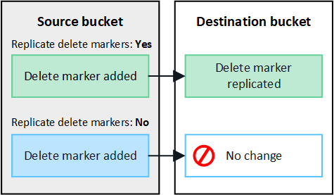

= 管理跨网格复制
:allow-uri-read: 
:icons: font
:imagesdir: ../media/

[role="lead"]
如果在创建租户帐户时为其分配了*使用网格联合连接*权限、则可以使用跨网格复制在租户源网格上的分段和租户目标网格上的分段之间自动复制对象。跨网格复制可以在一个方向或两个方向上进行。

== 跨网格复制工作流

此工作流图汇总了在两个网格上的分段之间配置跨网格复制所要执行的步骤。下面将详细介绍这些步骤。

image::../media/grid-federation-cgr-workflow.png[跨网格复制工作流]

== 配置跨网格复制

在使用跨网格复制之前、您必须登录到每个网格上的相应租户帐户并创建相同的分段。然后、您可以在一个存储分段或这两个存储分段上启用跨网格复制。

.开始之前
* 您已查看跨网格复制的要求。请参阅。 link:../admin/grid-federation-what-is-cross-grid-replication.html["什么是跨网格复制"]
* 您正在使用link:../admin/web-browser-requirements.html["支持的 Web 浏览器"]。
* 租户帐户具有*使用网格联合连接*权限、两个网格上都存在相同的租户帐户。请参阅。 link:../admin/grid-federation-manage-tenants.html["管理网格联盟连接允许的租户"]
* 您将登录的租户用户已位于两个网格上，并且属于具有的用户组link:tenant-management-permissions.html["root访问权限"]。
* 如果您要以本地用户身份登录到租户的目标网格、则租户帐户的root用户已为此网格上的用户帐户设置密码。

=== 创建两个相同的存储分段

首先、登录到每个网格上的相应租户帐户并创建相同的分段。

.步骤
. 从网格联合连接中的任一网格开始、创建一个新存储分段：
+
.. 使用两个网格上的租户用户凭据登录到租户帐户。
+

NOTE: 如果您无法以本地用户身份登录到租户的目标网格、请确认租户帐户的root用户已为您的用户帐户设置密码。

.. 按照的说明进行操作link:creating-s3-bucket.html["创建S3存储分段"]。
.. 在*管理对象设置*选项卡上，选择*启用对象版本控制*。
.. 如果为StorageGRID 系统启用了S3对象锁定、请勿为此存储分段启用S3对象锁定。
.. 选择 * 创建存储分段 * 。
.. 选择 * 完成 * 。

. 重复这些步骤、为网格联盟连接中另一个网格上的同一租户帐户创建相同的分段。
+

TIP: 根据需要、每个存储分段可以使用不同的区域。

=== 启用跨网格复制

在向任一存储分段添加任何对象之前、必须执行这些步骤。

.步骤
. 从要复制其对象的网格开始，启用link:../admin/grid-federation-what-is-cross-grid-replication.html["跨网格单向复制"]：
+
.. 登录到存储分段的租户帐户。
.. 从信息板中选择*查看存储分段*，或选择*存储(S3)*>*存储分段*。
.. 从表中选择存储分段名称以访问存储分段详细信息页面。
.. 选择*跨网格复制*选项卡。
.. 选择*Enable*，然后查看要求列表。
.. 如果满足所有要求、请选择要使用的网格联合连接。
.. (可选)更改*复制删除标记*的设置，以确定S3客户端向不包含版本ID的源网格发出删除请求时目标网格上会发生什么情况：
+
*** *Yes*(默认)：将删除标记添加到源存储分段并复制到目标存储分段。
*** *否*：删除标记已添加到源存储分段，但不会复制到目标存储分段。
+

+

NOTE: 如果删除请求包含版本ID、则该对象版本将从源存储分段中永久删除。StorageGRID 不会复制包含版本ID的删除请求、因此不会从目标中删除相同的对象版本。

+
有关详细信息、请参见。 link:../admin/grid-federation-what-is-cross-grid-replication.html["什么是跨网格复制"]

.. (可选)更改*跨网格复制*审核类别的设置以管理审核消息的数量：
+
*** *错误*(默认)：审核输出中仅包含失败的跨网格复制请求。
*** *正常*：包括所有跨网格复制请求，这会显著增加审核输出的量。

.. 查看您的选择。除非两个存储分段均为空、否则无法更改这些设置。
.. 选择*启用并测试*。
+
片刻后、将显示一条成功消息。现在、添加到此存储分段的对象将自动复制到其他网格。*跨网格复制*在存储分段详细信息页面上显示为已启用的功能。

. (可选)转至另一网格和上的相应link:../admin/grid-federation-what-is-cross-grid-replication.html["在两个方向上启用跨网格复制"]存储分段。

== 测试网格之间的复制

如果为存储分段启用了跨网格复制、则可能需要验证连接和跨网格复制是否正常工作、以及源存储分段和目标存储分段是否仍满足所有要求(例如、版本控制仍处于启用状态)。

.开始之前
* 您正在使用link:../admin/web-browser-requirements.html["支持的 Web 浏览器"]。
* 您属于具有的用户组link:tenant-management-permissions.html["root访问权限"]。

.步骤
. 登录到存储分段的租户帐户。
. 从信息板中选择*查看存储分段*，或选择*存储(S3)*>*存储分段*。
. 从表中选择存储分段名称以访问存储分段详细信息页面。
. 选择*跨网格复制*选项卡。
. 选择 * 测试连接 * 。
+
如果连接运行状况良好、则会显示成功横幅。否则、将显示一条错误消息、您和网格管理员可以使用该消息来解析问题描述。有关详细信息，请参见 link:../admin/grid-federation-troubleshoot.html["对网格联合错误进行故障排除"]。

. 如果跨网格复制配置为双向进行，请转到另一网格上的相应分段，然后选择*测试连接*，以验证跨网格复制是否在另一个方向工作。

== 禁用跨网格复制

如果不再需要将对象复制到另一个网格、则可以永久停止跨网格复制。

禁用跨网格复制之前、请注意以下事项：

* 禁用跨网格复制不会删除已在网格之间复制的任何对象。例如、如果对网格1上的存储分段禁用跨网格复制、则不会删除已复制到 `my-bucket`网格2上的对象 `my-bucket`。如果要删除这些对象、必须手动将其删除。
* 如果为每个分段启用了跨网格复制(即、如果是双向复制)、则可以为其中一个分段或这两个分段禁用跨网格复制。例如、您可能希望禁用将对象从网格1复制到网格 `my-bucket`2、同时继续将对象从 `my-bucket`网格2复制 `my-bucket`到网格 `my-bucket`1。
* 您必须先禁用跨网格复制、然后才能删除租户使用网格联盟连接的权限。请参阅。 link:../admin/grid-federation-manage-tenants.html["管理允许的租户"]
* 如果对包含对象的分段禁用跨网格复制、则无法重新启用跨网格复制、除非同时从源分段和目标分段中删除所有对象。
+

CAUTION: 除非两个分段均为空、否则无法重新启用复制。

.开始之前
* 您正在使用link:../admin/web-browser-requirements.html["支持的 Web 浏览器"]。
* 您属于具有的用户组link:tenant-management-permissions.html["root访问权限"]。

.步骤
. 从不再需要复制对象的网格开始、停止对分段的跨网格复制：
+
.. 登录到存储分段的租户帐户。
.. 从信息板中选择*查看存储分段*，或选择*存储(S3)*>*存储分段*。
.. 从表中选择存储分段名称以访问存储分段详细信息页面。
.. 选择*跨网格复制*选项卡。
.. 选择*禁用复制*。
.. 如果确实要禁用此存储分段的跨网格复制，请在文本框中键入*Yes*，然后选择*Disable"。
+
片刻后、将显示一条成功消息。添加到此存储分段的新对象无法再自动复制到其他网格。*跨网格复制*不再显示为"分段"页面上的"已启用"功能。

. 如果跨网格复制配置为双向进行、请转到另一个网格上的相应存储分段、并停止另一个方向的跨网格复制。

