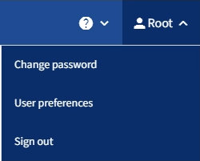

= 注销租户管理器
:allow-uri-read: 
:icons: font
:imagesdir: ../media/

[role="lead"]
使用租户管理器完成操作后、您必须注销以确保未经授权的用户无法访问StorageGRID 系统。根据浏览器 Cookie 设置，关闭浏览器可能无法将您从系统中注销。

.步骤
. 找到用户界面右上角的用户名下拉列表。
+

. 选择用户名，然后选择*Sign Out。
+
** 如果未使用 SSO ：
+
您已从管理节点注销。此时将显示租户管理器登录页面。

+

NOTE: 如果您已登录到多个管理节点，则必须从每个节点注销。

** 如果启用了 SSO ：
+
您已从正在访问的所有管理节点中注销。此时将显示 StorageGRID 登录页面。您刚刚访问的租户帐户的名称将在 * 近期帐户 * 下拉列表中列为默认名称，并显示租户的 * 帐户 ID* 。

+

NOTE: 如果启用了 SSO ，并且您还登录到网格管理器，则还必须注销网格管理器才能注销 SSO 。

